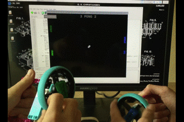

## Einleitung

In diesem Projekt verwendest du den Raspberry Pi Build HAT, einen LEGO® Technic™ Motor-Encoder und ein LEGO®-Rad sowie die Python Turtle-Bibliothek, um einen einfachen Gamecontroller zu erstellen, mit dem du Pong spielen kannst.

[Pong](https://de.wikipedia.org/wiki/Pong) ist eines der ersten Arcade-Videospiele, das ursprünglich 1972 von Atari veröffentlicht wurde. Es ist ein Tischtennisspiel mit einfacher zweidimensionaler Grafik. Die Spieler steuern Schläger auf jeder Seite des Bildschirms, mit denen sie einen Ball hin und her schlagen.

Du wirst:
- Erfahren, wie du die Drehwinkel von LEGO® Technic™ Motoren abliest
- Lernen, Turtle-Grafiken mit LEGO® Technic™-Motoren zu zeichnen und zu bewegen
- Lernen, mit Hilfe von `x` und `y` Koordinaten, Kollisionen zwischen Grafiken zu erkennen

--- no-print ---

--- /no-print ---

--- print-only ---

--- /print-only ---

### Was du brauchen wirst

+ Einen Raspberry Pi Computer
+ Ein Raspberry Pi Build HAT
+ Mindestens einen LEGO® Technic™ Motor
+ Ein Sortiment von LEGO®-Teilen, einschließlich Rädern (wir haben eine Auswahl aus dem [LEGO® Education SPIKE™ Prime-Set verwendet](https://education.lego.com/en-gb/product/spike-prime))
+ Ein kleines Steckbrett (optional)
+ Einen Summer (optional)
+ Einige Steckbrett-Kabel (optional)
+ Ein 7,5-V-Netzteil mit Hohlstecker (optional). Du kannst für dieses Projekt ein offizielles Raspberry Pi-Netzteil verwenden, da die Motor-Encoder keinen Strom verbrauchen

### Software

+ Python 3
+ Die Build HAT Python-Bibliothek

--- collapse ---
---
title: Zusätzliche Informationen für Pädagogen
---

Sie können das fertige Projekt [hier](https://rpf.io/p/de-DE/lego-game-controller-get){:target="_blank"} herunterladen.

Wenn sie dieses Projekt ausdrucken möchten, sollten sie die [druckerfreundliche Version](https://projects.raspberrypi.org/de-DE/projects/lego-game-controller/print){:target="_blank"} verwenden.

--- /collapse ---

Bevor du beginnst, musst du deinen Raspberry Pi-Computer eingerichtet und deinen Build HAT aufgesteckt haben:

--- task ---

Montiere deinen Raspberry Pi mit M2-Schrauben und Muttern auf der LEGO Maker Platte und stelle sicher, dass sich der Raspberry Pi auf der flachen Seite befindet:

 

--- /task ---

Die Montage des Raspberry Pi auf diese Weise ermöglicht einen einfachen Zugriff auf die Anschlüsse und den SD-Kartensteckplatz. Mit der Maker Platte kannst du den Raspberry Pi einfacher mit der Hauptstruktur deines Dashboards verbinden.

--- task ---

Richte den Build HAT mit dem Raspberry Pi aus und stelle sicher, dass du die Beschriftung `This way up` siehst. Stelle sicher, dass alle GPIO-Pins vom Stecker des HAT bedeckt sind, und drücke ihn fest nach unten. (Das Beispiel verwendet einen [Stacking-Header](https://www.adafruit.com/product/2223){:target="_blank"} (Stapel-Stecker), der die Pins verlängert.)

 

--- /task ---

Jetzt solltest du deinen Raspberry Pi über die 7,5-V-Hohlstecker-Buchse des Build HAT mit Strom versorgen, damit du die Motoren verwenden kannst.

--- task ---

Wenn du dies noch nicht getan hast, richte deinen Raspberry Pi ein, indem du diesen Anweisungen folgst:

[Einrichten deines Raspberry Pi](https://projects.raspberrypi.org/de-DE/projects/raspberry-pi-setting-up){:target="_blank"}

--- /task ---

--- task ---

Nachdem der Raspberry Pi gebootet hat, öffne das Raspberry Pi Configuration Tool, indem du auf die Schaltfläche Raspberry Menu (Himbeere) klickst und dann „Einstellungen“ und dann „Raspberry Pi Konfiguration“ auswählst.

Klicke auf die Registerkarte "Schnittstellen" und passe die seriellen Einstellungen wie unten gezeigt an:

--- /task ---

--- task ---

Du musst auch die buildhat Python-Bibliothek installieren, indem du diese Anweisungen befolgst:

--- collapse ---
---
title: Installation der buildhat Python-Bibliothek
---

Öffne ein Terminalfenster auf deinem Raspberry Pi, indem du <kbd>Strg</kbd>+<kbd>Alt</kbd>+<kbd>T</kbd>drückst.

Gib an der Eingabeaufforderung `sudo pip3 install buildhat` ein

Drücke <kbd>Enter</kbd> und warte auf die Meldung "Installation abgeschlossen".

--- /collapse ---

--- /task ---
