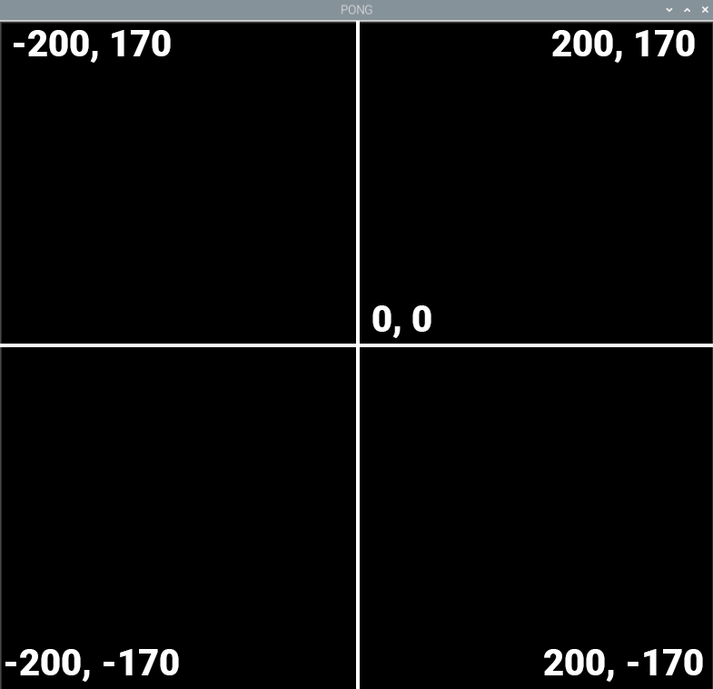

## Erstelle deinen Pong-Bildschirm

Turtle ist eine Zeichen- und Animationsbibliothek und du kannst mit diesem [ausgezeichneten Projekt](https://projects.raspberrypi.org/de-DE/projects/turtle-race) mehr darüber lernen.

Erstelle zunächst ein Fenster, in dem das Spiel gespielt wird.

--- task ---

Öffne eine neue Datei in Thonny und füge den folgenden Code hinzu, um die turtle-, time- und buildhat-Bibliotheken zu importieren und dann einen Bildschirm einzurichten. Führe die Datei aus und du solltest ein schwarzes Fenster mit dem Titel "PONG" sehen. Die `#` Kommentare musst du nicht einfügen.

--- code ---
---
language: python   
filename: pong.py   
line_numbers: true   
line_number_start: 1
line_highlights:
---

from turtle import Screen, Turtle 
from time import sleep 
from buildhat import Motor

spielflaeche = Screen() #erstelle einen Bildschirm   
spielflaeche.title("PONG") #gib dem Bildschirm einen Titel   
spielflaeche.bgcolor('black') #setze die Hintergrundfarbe   
spielflaeche.tracer(0) #aktiviere flüssigere Animationen

--- /code ---

--- /task ---

Die Turtle-Bibliothek bietet auch eine nützliche Möglichkeit, die Koordinaten für einen Bildschirmbereich festzulegen. Füge diesen Code deinem Programm hinzu:

--- task ---

--- code ---
---
language: python   
filename: pong.py   
line_numbers: true   
line_number_start: 8
line_highlights: 9
---

spielflaeche.tracer(0)   
spielflaeche.setworldcoordinates(-200, -170, 200, 170)

--- /code ---

--- /task ---

Dadurch entsteht ein rechteckiges Fenster mit einer Breite von 400 Pixeln und einer Höhe von 340 Pixeln, wobei der 0-Punkt in der Mitte liegt.

--- task ---

Jetzt musst du deinen Spielbereich aktualisieren, um das Paddel und den Ball zu sehen. Füge am Ende deines Codes die **Spielschleife** hinzu und rufe die Methode `update()` auf.

--- code ---
---
language: python   
filename: pong.py   
line_numbers: true   
line_number_start: 10
line_highlights:
---

while True:   
    spielflaeche.update()

--- /code ---

Führe deinen Code aus und du solltest ein schwarzes Fenster sehen.

--- /task ---

--- task ---

Als nächstes kannst du einen Ball machen, indem du eine Turtle verwendest, die als weißer Kreis festgelegt ist. Der Ball sollte in der Mitte des Bildschirms beginnen und keine Linie ziehen, wenn er sich bewegt.

Füge den folgenden Code **vor** deiner `while True` Schleife, hinzu:

--- code ---
---
language: python   
filename: pong.py   
line_numbers: true   
line_number_start: 10
line_highlights:
---

ball = Turtle()   
ball.color('white')   
ball.shape('circle')   
ball.penup()   
ball.setpos(0,0)

while True:

--- /code ---

--- /task ---

--- task ---

Teste deinen Code nochmals. Du solltest einen weißen Ball in deinem Fenster sehen.

--- /task ---

--- task ---

Als nächstes kannst du auf die gleiche Weise einen Schläger einrichten. Es ist ein grünes Rechteck und wird ganz links auf dem Bildschirm positioniert.

--- code ---
---
language: python   
filename: pong.py   
line_numbers: true   
line_number_start: 17
line_highlights:
---

schlaeger_links = Turtle()   
schlaeger_links.color('green')   
schlaeger_links.shape('square')   
schlaeger_links.shapesize(4, 1, 1)   
schlaeger_links.penup()   
schlaeger_links.setpos(-190, 0)

--- /code ---

--- /task ---

--- task ---

Führe deinen Code aus und du solltest deinen Ball und deinen Schläger sehen.

--- /task ---
