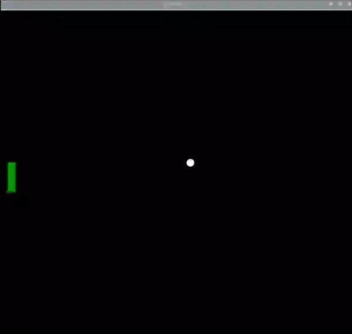

## Steuere den Schläger

### Gestaltung der Bedienelemente

Der LEGO® Spike™ Motor soll verwendet werden, um die Position des Schlägers zu steuern, aber du möchtest keine vollen Umdrehungen zulassen.

Eine einfache Möglichkeit, die Bewegung des Rades zu begrenzen, besteht darin, ein LEGO®-Element hinzuzufügen, um zu verhindern, dass sich das Rad um eine vollständige Drehung dreht.

--- task ---

Richte, wie zuvor, die Encodermarkierungen an deinem Motor mit dem Rad aus. Setze einen Zapfen oder eine Achse so nah wie möglich an den Markierungen ein.

--- /task ---

--- print-only ---

--- /print-only ---

--- task ---

Füge nach der Importzeile eine Zeile hinzu, um das `motor_links` Objekt zu erstellen.

--- code ---
---
language: python   
filename: pong.py   
line_numbers: true   
line_number_start: 3
line_highlights: 5
---

from buildhat import Motor

motor_links = Motor('A')

--- /code ---

--- /task ---

Jetzt wird eine neue Variable benötigt, um die Position des Schlägers zu verfolgen. Diese wird `pos_links` genannt und auf `0` gesetzt.

--- code ---
---
language: python   
filename: pong.py   
line_numbers: true   
line_number_start: 26
line_highlights: 29
---

ball.speed_x = 0.4   
ball.speed_y = 0.4

pos_links = 0

--- /code ---

--- task ---

Erstelle eine Funktion für den Schläger, die ausgeführt wird, wenn der Motor-Encoder bewegt wird. Beachte, dass hier eine `globale` Variable verwendet werden muss, damit der Wert von `pos_links` geändert werden kann.

--- code ---
---
language: python   
filename: pong.py   
line_numbers: true   
line_number_start: 31
line_highlights:
---

def drehung_links(motor_speed, motor_rpos, motor_apos):   
    global pos_links   
    pos_links = motor_apos

--- /code ---

--- /task ---

--- task ---

Füge nun eine einzelne Zeile hinzu, die diese Funktion jedes Mal aufruft, wenn der Motor bewegt wird. Das kann knapp vor deiner `while` Schleife sein.

--- code ---
---
language: python   
filename: pong.py   
line_numbers: true   
line_number_start: 35
line_highlights:
---

motor_links.when_rotated = drehung_links

--- /code ---

--- /task ---

--- task ---

Füge dann eine Zeile zur `while True` Schleife hinzu, um das Schläger-Objekt auf dem Bildschirm an die neue Position zu verschieben.

--- code ---
---
language: python   
filename: pong.py   
line_numbers: true   
line_number_start: 45
line_highlights: 47
---

    if ball.ycor() < -160:   
        ball.speed_y *= -1   
    schlaeger_links.sety(pos_links)

--- /code ---

--- /task ---

--- task ---

Führe deinen Code aus und drehe dann das Rad an deinem Motor-Encoder. Du solltest sehen, wie sich dein Schläger auf dem Bildschirm nach oben und unten bewegt.

--- /task ---

Falls es Fehler gibt, hier siehst du wie dein Code derzeit aussehen sollte:

--- code ---
---
language: python   
filename: pong.py   
line_numbers: true   
line_number_start:
line_highlights:
---

from turtle import *   
from time import sleep   
from buildhat import Motor

motor_links = Motor('A')

spielflaeche = Screen()   
spielflaeche.title("PONG")   
spielflaeche.bgcolor("black")   
spielflaeche.tracer(0)   
spielflaeche.setworldcoordinates(-200,-170,200,170)

ball = Turtle()   
ball.color('white')   
ball.shape('circle')   
ball.penup()   
ball.setpos(0,0)

schlaeger_links = Turtle()   
schlaeger_links.color('green')   
schlaeger_links.shape('square')   
schlaeger_links.shapesize(4,1,1)   
schlaeger_links.penup()   
schlaeger_links.setpos(-190,0)

ball.speed_x = 0.4   
ball.speed_y = 0.4

pos_links = 0

def drehung_links(motor_speed, motor_rpos, motor_apos):   
    global pos_links   
    pos_links = motor_apos

motor_links.when_rotated = drehung_links

while True:   
    spielflaeche.update()   
    ball.setx(ball.xcor() + ball.speed_x)   
    ball.sety(ball.ycor() + ball.speed_y)   
    if ball.ycor() > 160: 
        ball.speed_y *= -1   
    if ball.xcor() > 195: 
        ball.speed_x *= -1   
    if ball.ycor() < -160:   
        ball.speed_y *= -1   
    schlaeger_links.sety(pos_links)

--- /code ---

--- save ---