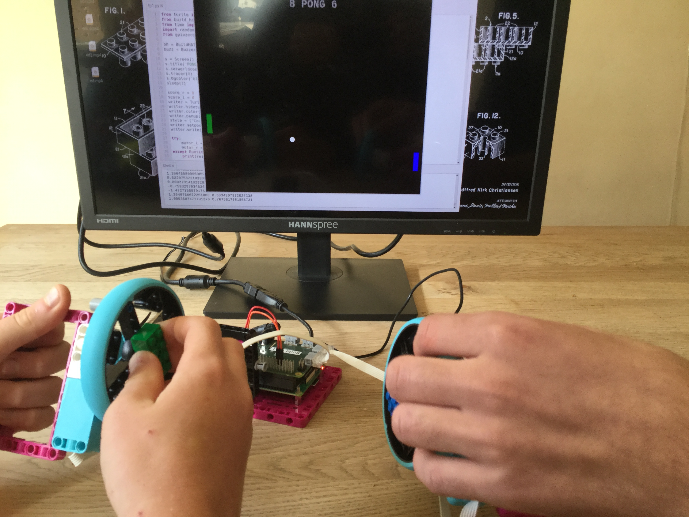

## Introduction

Use LEGO and the Raspberry Pi Build HAT to build games controller for a simple version of the classic Pong arcade gamne. Add some simple electronics for external lights and sounds. 

### What you will make

In this project you will learn how to create a Python program game that uses LEGO motors for its controllers.

--- print-only ---

--- /print-only ---

--- collapse ---
---
title: What you will need
---
### Hardware

This project can be tackled without the need for an additional power supply for the BuildHAT. Because the motors are moved by hand, an normal 5v Raspberry Pi power supply is all that it is needed. 

+ A Raspberry Pi computer
+ A Raspberry Pi Build HAT
+ At least one LEGO Technic motor
+ Assortment of LEGO, including two wheels. We used a selection from the [LEGO Spike Prime kit](https://education.lego.com/en-gb/product/spike-prime)
+ A small breadboard (optional)
+ Some LEDs and 100 ohm resistors (optional)
+ Some breadboard jumper leads (optional)
+ A 9v power supply with a barrel jack.(optional) This can be a battery pack, but make sure that all cells are fully charged. 

### Software

+ Python 3
+ Build HAT Python library

### Downloads

--- /collapse ---

--- collapse ---
---
title: What you will learn
---

- How to read position values from LEGO Technic motor encoders
- How to create a simple game using the Python Turtle library
- How to add am electronic buzzer to your project

--- /collapse ---

--- collapse ---
---
title: Additional information for educators
---

You can download the completed project [here](http://rpf.io/p/en/projectName-get){:target="_blank"}.

If you need to print this project, please use the [printer-friendly version](https://projects.raspberrypi.org/en/projects/projectName/print){:target="_blank"}.

--- /collapse ---
