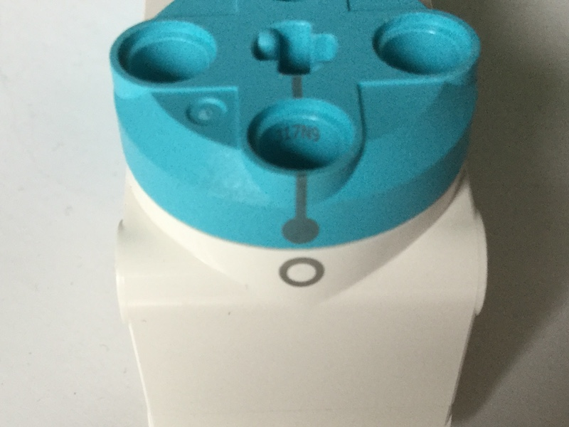
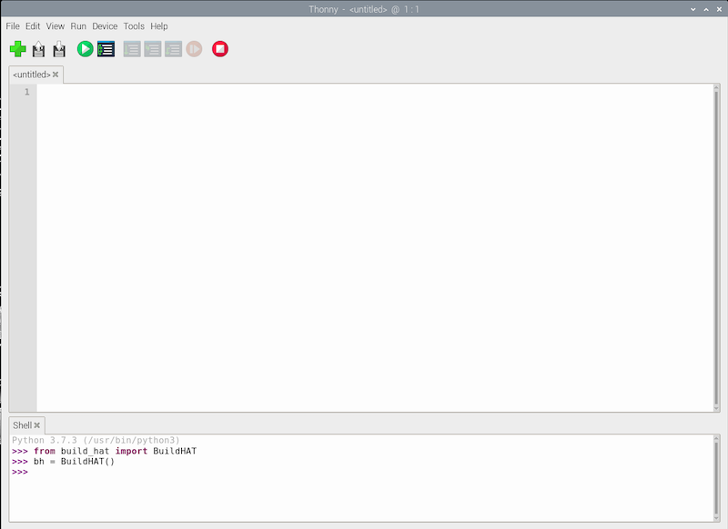

## Using Spike motor encoders



Motor encoders can not only rotate, they can also accurately detect how many degrees they have been rotated.

The LEGO motors all have encoders. If you look at the rotating disk part of the motor, you will see a mark shaped like a lollipop that can be lined up with the 0 mark on the white body of the motor itself. This is the encoder set to zero degrees and any angular movement of the motor shaft can be measured relative to this point.

--- collapse ---
---
title: How motor encoders work
---

A motor encoder, also called a rotary or shaft encoder, is an electro-mechanical device that allows you to record the angular position or motion of the axle. It normally does this by converting the angular position to an analog or digital output. 

If a motor has an encoder, that means you can very accurately set the position of the axle. It also allows you to use the motor as an input device so that if something changes the position of the axle, this can be registered and used to trigger other actions in a computer program. 

--- /collapse ---

--- task ---

Connect your BuildHAT to your Raspberry Pi, and then connect the power, either though the BuildHAT barrel jack or the USB-C port on the Raspberry Pi.

Connect a monitor, keyboard and mouse to your Raspberry Pi.

--- /task ---

--- task ---

Connect a motor to port A on the BuildHAT.


--- /task ---

--- task ---

 Attach a large wheel to the motor using 4 connector pegs. Turn the wheel so that the lollipop mark is in line with the zero.

 
 
symbols.jpg)

--- /task ---

--- task ---

Open Thonny from the Raspberry Pi **Programming** menu and click onto the REPL box at the bottom. 

--- /task ---

--- task ---

First import the BuildHAT library

```python
from buildhat import Motor
```

Then create a motor object that refers to the specific port on the HAT to which you have connected a motor. 

```python
m1 = Motor('A')
```

--- /task ---




--- task ---

Now you can ask the motor to report its *absolute* position:

```python
m1.get_aposition()
```
which should produce a signed integer as the output:

4

Depending on how accurately you aligned the lollipop mark with the zero, the number you see should be close to 0.

--- /task ---

--- task ---

You can also keep track of the motor's *relative* position:

```python
m1.get_position()
```
which, as long as you have not moved the motor encode, should display zero as an output.

0

--- /task ---
--- task ---

Now move the by motor by rotating the wheel by roughly 90 degrees in the clockwise direction. Ask the motor's absolute position again and you should see that the output has changed.

87

Checking the relative position should a similar value:

83

(in fact it should be the difference between the original and latest absolute positions)


--- /task ---

--- task ---

Now rotate the wheel by a further 180 degrees clockwise. Check the absolute position again:

-83

This will be quite different from the relative position, which should be something like:

271
--- /task ---

--- task ---

Now rotate the wheel one more time, by 180 degrees clockwise again. The absolute position should be close to:

79

But the relative position will be something like:

435
--- /task ---

From that motor wiggling you may have already worked out the difference between `get_aposition()` and `get_position()`. Asking for the absolute position will always return an integer between -180 and 180 degrees which corresponds to the lollipop mark's position with respect to the zero mark. Multiple rotations make no difference. If the lollipop is 3 degrees to the left of the zero mark, its absolute position will be -3 even if the motor had been spun round and round 100 times.

The relative position is different as it records how many degrees the motor has been turned through since you created the motor object. Multiple rotations are counted so if you spin the motor encoder all the way around 10 times, it should report a value of 3600.


