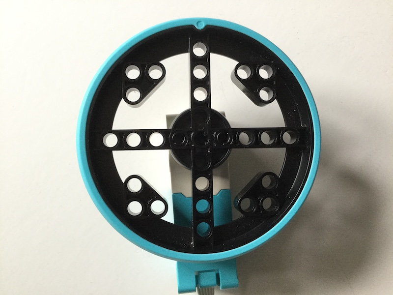

## Motor encoders

Let's look at how motor encoders work.

A motor encoder, also called a rotary or shaft encoder, is an electro-mechanical device that allows you to record the angular position or motion of the axle. It normally does this by converting the angular position to an analog or digital output. 

If a motor has an encoder, that means you can very accurately set the position of the axle. It also allows you to use the motor as an input device so that if something changes the position of the axle, this can be registered and used to trigger other actions in a computer program. 

The LEGO motors all have encoders. If you look at the rotating disk part of the motor, you will see a mark shaped like a lollipop that can be lined up with the 0 mark on the white body of the motor itself. This is the encoder set to zero degrees and any angular movement of the motor shaft can be measured relative to this point.


Let’s see that in action with some code.

--- task ---

Connect a monitor, keyboard and mouse to your Raspberry Pi.

Attach the Build HAT to your Raspberry Pi and *either* connect a 7.5v power supply to the barrel jack of the BuildHAT *or* use the stnadrd USB-C power socket on the Raspberry Pi to power up the computer. ]

--- /task ---

--- task ---

Connect a motor to port A on the BuildHAT. Attach a wheel to the motor.



--- /task ---

--- task ---

Once the Raspberry Pi has booted, open Thonny from the Raspberry Pi OS Desktop and click onto the REPL box at the bottom. 


--- /task ---

--- task ---

First import the BuildHAT library

```python
from build_hat import BuildHAT
```

Then initialise a connection to the HAT

```python
bh = BuildHAT()
```

--- /task ---


--- task ---

Create a shortcut variable for the motor to abstract away the motor details such as which port it is connected to. Then ask the motor to report its status:

```python
m1 = bh.port.A.motor
m1.get()
```
You should see a Python list with 4 items returned and displayed:

[0, 68, 60, 0]

--- /task ---
--- task ---

Now move the by motor by rotating the wheel to any random position. Ask the motor's position again and you should see that two of the values in the list have changed.

[0, 143, 131, 0]


--- /task ---

--- task ---

Now rotate the wheel again and set the motor to its zero degrees position, so that the lollipop markers is aligned with the 0.  Ask the motor's position again and you should see that the third value will be close to or equal to zero, depending on how accurately you were able to line up the two markers. 

[0, 11, 2, 0]


--- /task ---

To use the LEGO motors as a controller for a game, you'll ned to be able to constantly read their position so that the gameplay feels responsive and isn't too laggy. Let's a write a Python program to do that. 

--- task ---

In the main Thonny window above the REPL, write a program that uses the code you've already seen within a loop so that the position value is contantly displayed.

--- hints ---
--- hint ---
First of all, import the BuildHAT library and set up a connection to the HAT

```python
from build_hat import BuildHAT
bh = BuildHAT()
```
--- /hint ---
--- hint ---
You need to read the status of the motor.  You're only interested in teh third value in the list that is returned so you can use [2] to select that (remember you start counting list items at 0). Beacuse you're running this as a priogram rather than line by line in the REPL, you'll need to use the `print()` function to display the values. 

```python
m1 = bh.port.A.motor
print(m1.get()[2])
```
--- /hint ---

--- hint ---
Finally wrap the last line within a while loop so that the whole program looks like:

```python
from build_hat import BuildHAT
bh = BuildHAT()

m1 = bh.port.A.motor
while True:
    print(m1.get()[2])
```
--- /hint ---

--- /hints ---

--- /task ---
Next you can start thinking about your game and how to integrate this code so that the motors can be used as controllers. 

--- save ---
