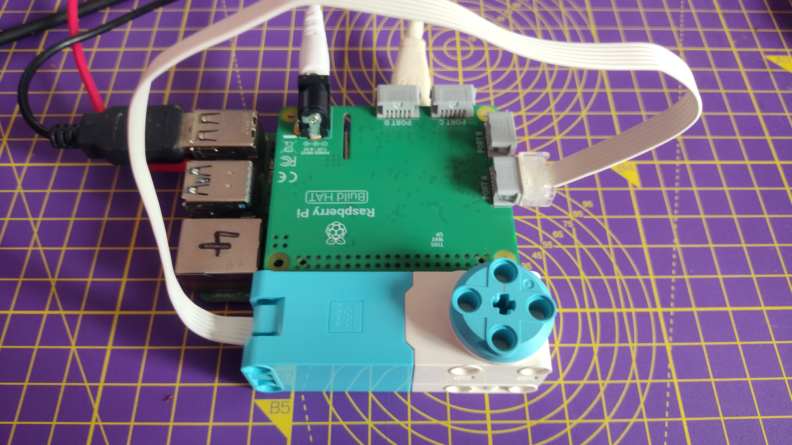
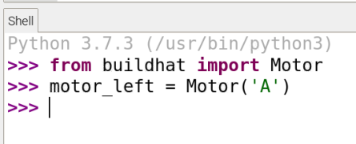

## Using Spike motor encoders

Motor encoders can not only rotate, they can also accurately detect how many degrees they have been rotated.


The LEGO motors all have encoders. If you look at the rotating disk part of the motor, you will see a mark shaped like a lollipop that can be lined up with the 0 mark on the white body of the motor itself. This is the encoder set to zero degrees and any angular movement of the motor shaft can be measured relative to this point.

--- collapse ---
---
title: How motor encoders work
---

A motor encoder, also called a rotary or shaft encoder, is an electro-mechanical device that allows you to record the angular position or motion of the axle. It normally does this by converting the angular position to an analog or digital output. 

If a motor has an encoder, that means you can very accurately set the position of the axle. It also allows you to use the motor as an input device so that if something changes the position of the axle, this can be registered and used to trigger other actions in a computer program. 

--- /collapse ---

--- task ---

Connect your BuildHAT to your Raspberry Pi, and then connect the power, either though the BuildHAT barrel jack or the USB-C port on the Raspberry Pi.

Connect a monitor, keyboard and mouse to your Raspberry Pi.

--- /task ---

--- task ---

Connect a motor to port A on the BuildHAT.



--- /task ---

--- task ---

Attach a large wheel to the motor using 4 connector pegs. Turn the wheel so that the lollipop mark is in line with the zero.


--- /task ---

--- task ---

Open Thonny from the Raspberry Pi **Programming** menu and click onto the **Shell** box at the bottom of the window. 

--- /task ---

--- task ---

First import the BuildHAT library

```python
from buildhat import Motor
```

Then create a motor object that that tells Python the motor is connected to port `A`

```python
motor_1eft = Motor('A')
```



--- /task ---

--- task ---

Now you can ask the motor to report its *absolute* position. This will always be between `-180` and `180`.

```python
motor_1eft.get_aposition()
```

Depending on how well you positioned the motor at the start, you should get a value close to `0`.

Move the motor and type the line a second time, and see how the value changes

--- /task ---

--- task ---

You can also keep track of the motor's *relative* position. This is how far it has moved from the time the program starts, so it will increase or decrease by `360` for every turn of the wheel.

```python
motor_1eft.get_position()
```
--- /task ---

--- task ---

Move the motor around an check it's absolute and relative positions, so that you understand how the values change.

--- /task ---


