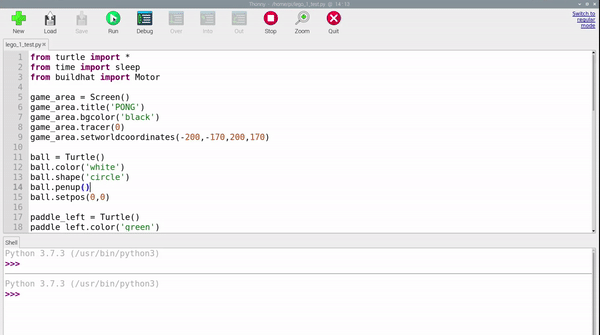

## Moving the ball

The ball is going to bounce around the screen, so two variables are needed to keep track of its speed in both the `x` and `y` dirctions. These numbers can be larger to make the game harder, or smaller to make the game easier.

--- task ---

Add the following code to your program:

--- code ---
---
language: python   
filename: pong.py   
line_numbers: true   
line_number_start: 23   
line_highlights:   
---

ball.speed_x = 1   
ball.speed_y = 1   

--- /code ---

--- /task ---

You can check where a Turtle is by using `turtle.xcor()` and `turtle.ycor()` to find the `x` and `y` coordinates, respectively. 

So to make the ball move, you can combine the position and speed. 

--- task ---
Add the lines below to your program:

--- code ---
---
language: python   
filename: pong.py   
line_numbers: true   
line_number_start: 27   
line_highlights: 30, 31   
---

while True:   
    game_area.update()   
    ball.setx(ball.xcor() + ball.speed_x)   
    ball.sety(ball.ycor() + ball.speed_y)   

--- /code ---

--- /task ---

Run the program and see what happens!

The ball should move diagonally upwards towards the top right corner of the game area... and then keep on going! If you want your game to be fast and challenging, you can increase the `speed_x` and `speed_y` values to make the ball move more quickly. 

The ball should bounce off the top wall rather than disappear off the screen. To do this, the speed can be reversed, making the ball travel in the opposite direction, if its `y` position is greater than 160. 

--- task ---

Add the following code into your game loop and run it. 

--- code ---
---
language: python   
filename: pong.py     
line_numbers: true   
line_number_start: 27   
line_highlights: 32, 33   
---

while True:   
    game_area.update()   
    ball.setx(ball.xcor() + ball.dx)   
    ball.sety(ball.ycor() + ball.dy)   
    if ball.ycor() > 160:   
        ball.speed_y *= -1   

--- /code ---

--- /task ---

--- task ---

Run your code again, and the ball should bounce off the top of the screen, but disappear off the right of the screen.

--- /task ---

In the same way that the code checks the upper `y` position of the ball, to make it bounce, it can check the right `x` position and the lower `y` position, in your game loop.

--- task ---

Add these checks on the ball's position.

--- code ---
---
language: python   
filename: pong.py   
line_numbers: true   
line_number_start: 32   
line_highlights:   
---
    if ball.ycor() > 160:   
        ball.speed_y *= -1   
    if ball.xcor() > 195:   
        ball.speed_x *= -1   
    if ball.ycor() < -160:   
        ball.speed_y *= -1   
--- /code ---

--- /task ---

The ball should now bounce around the screen, and fly off the left edge. Next, you will control your paddle to reflect the ball back from the left edge.

--- save ---
