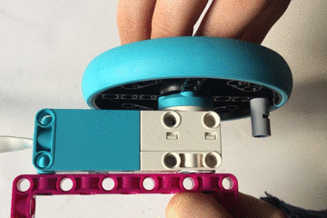
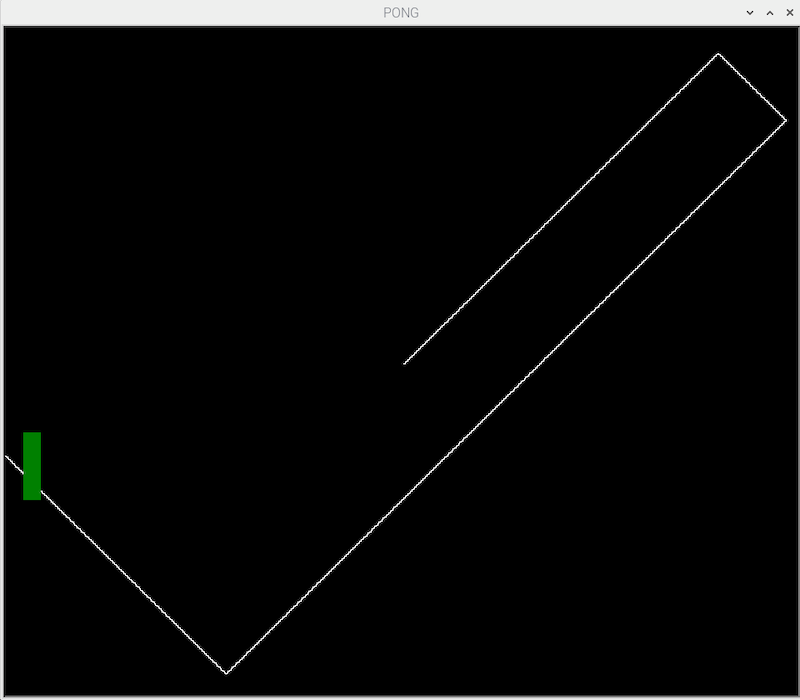

## Adding paddles

### Designing the controls

The LEGO Technic motor is going to be used to control the position of a paddle but you don't want to be able to make full turns. 

A simple way to limit the motion of the wheel is to add a LEGO element to prevent the wheel turning through a complete rotation.  



--- print-only ---

--- /print-only ---

The turtle is the building block of the game.  It is already being used as the ball, now it can be used to create a paddle. 

### Creating a coloured paddle

Add the code below to your program, before the `while True` loop. This should look similar to the way we created a ball. One new function is`turtle.shapesize(x,y,c)` which is used to stretch the size of a turtle's shape. Experiment with different values to see how this works and pick ones that meet your idea for a pong game. If you have a fast moving ball then you might want a bigger paddle to make the game easier. 

--- task ---

```python
paddle_l = Turtle()
paddle_l.color('green')
paddle_l.shape('square')
paddle_l.shapesize(4,1,1)
paddle_l.penup()
paddle_l.setpos(-190,0)
l_pos = 0
```

--- /task ---

Run the code. You should see a green paddle on the left of the game area. Now to make this move using the LEGO technic motor.

### Moving the paddle

We can now integrate the code we wrote back in the first step, to constantly read the position of a motor. 

--- task ---
First, add the line that imports the build_hat library to the top of your program. 

--- /task ---

--- task ---
Then add the motor object creation line after the import lines. To help make the program easier to understand, use the variable name `motor_l` to indicate it s being used for the left hand paddle. 

--- /task ---

You could add a line with the `while True:` to constantly ask the motor for its absolute position and update the corresponding paddle's position accordingly. However this is not very efficient - it is better to use the callbacks we looked at earlier. 

--- task ---
Create a function for the paddle that will be run when the motor encoder moves. Not that it uses a `global` variable so that it can change the variable used to store the paddle's position. 

```python
def moved_l(motor_speed, motor_rpos, motor_apos):
    global pos_l
    pos_l = motor_apos

```

--- /task ---

--- task ---
Then add a line to the `while True` loop to update the paddle object on the screen to the new position. 

```python
paddle_l.sety(pos_l)

```

--- /task ---



Your program should look like this:

```python
from turtle import *
from time import sleep
from buildhat import Motor

motor_l = Motor('A')

game_area = Screen()
game_area.title('PONG')
game_area.setworldcoordinates(-200,-170,200,170)
game_area.tracer(0)
game_area.bgcolor('black')

ball = Turtle()
ball.color('white')
ball.shape('circle')
ball.pendown()
ball.setpos(0,0)

ball.speed(0)
ball.dx = 0.7
ball.dy = 0.7

paddle_l = Turtle()
paddle_l.color('green')
paddle_l.shape("square")
paddle_l.shapesize(4,1,1)
paddle_l.penup()
paddle_l.setpos(-190,0)
l_pos = 0

def moved_l(motor_speed, motor_rpos, motor_apos):
    global pos_l
    pos_l = motor_apos

while True:
    game_area.update()
    pos_l = motor_l.get()[2]
    paddle_l.sety(pos_l)
    ball.setx(ball.xcor() + ball.dx)
    ball.sety(ball.ycor() + ball.dy)
    if ball.ycor() > 160: # or ball.ycor() < -165: # bottom
        ball.dy *= -1
    if ball.ycor() < -160: # or ball.ycor() < -165: # bottom
        ball.dy *= -1
    if ball.xcor() > 195: # or ball.ycor() < -165: # bottom
        ball.dx *= -1
```

--- save ---