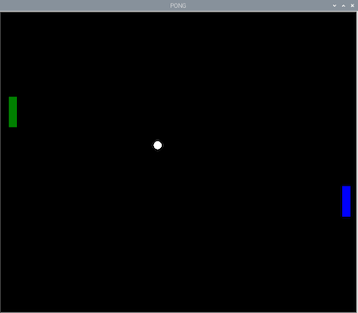

## Paddle collisions

The game is nearly complete - but first you need to add some extra collision detection that covers the ball hitting the paddle. 

--- task ---
Within the `while True` loop, check if the balls y position is in the vertical line in which the paddle moves. Also use an `and` because to check ball's x position is within the horizontal area covered by the paddle. 

--- code ---
---
language: python
filename: pong.py
line_numbers: true
line_number_start: 49
line_highlights: 50
---
paddle_left.sety(pos_left)
if (ball.xcor() < -180 and ball.xcor() > -190) and (ball.ycor() < paddle_l.ycor() + 20 and ball.ycor() > paddle_l.ycor() - 20):
    ball.setx(-180)
    ball.dx *= -1
--- /code ---

--- /task ---

Try the program out. You should be able to bounce the ball off you paddle and play a solo game of squash.

Now you have a way of preventing the ball from disappearing off-screen, it's time to think about what happens if you fail to make a save. 

For now let's just reset the ball back to start.

--- task ---
Add this code within the `while True` loop:

--- code ---
---
language: python
filename: pong.py
line_numbers: true
line_number_start: 52
line_highlights: 53-56
---
        ball.dx *= -1
    if ball.xcor() < -195: # left
        ball.hideturtle()
        ball.goto(0,0)
        ball.showturtle()
--- /code ---

--- /task ---

Once you're happy with the various settings, it's time to add in the second paddle.

--- task ---
Using what you've created for the left hand paddle as a starting point, add a second paddle on the right hand side of the game area. 

--- task ---

First of all, connect a second motor to the Build HAT (port B) and set it up in the program 

--- code ---
---
language: python
filename: pong.py
line_numbers: true
line_number_start: 5
line_highlights: 6
---
motor_left = Motor('A')
motor_right = Motor('B')
--- /code ---
--- /task ---

--- task ---

You can copy and past your code for setting up your left paddle, and change the name and values for your right paddle

--- /task ---

--- task ---

Create your right paddle

--- code ---
---
language: python
filename: pong
line_numbers: true
line_number_start: 20
line_highlights: 27-32
---
paddle_left = Turtle()
paddle_left.color('green')
paddle_left.shape("square")
paddle_left.shapesize(4,1,1)
paddle_left.penup()
paddle_left.setpos(-190,0)

paddle_right = Turtle()
paddle_right.color('blue')
paddle_right.shape("square")
paddle_right.shapesize(4,1,1)
paddle_right.penup()
paddle_right.setpos(190,0)
--- /code ---

--- /task ---

--- task ---

Add a variable for the right paddle position, a function for the paddle, and the line to call the function when the right motor is moved.

--- code ---
---
language: python
filename: pong.py
line_numbers: true
line_number_start: 37
line_highlights: 38, 46-48, 52
---
pos_left = 0
pos_right = 0

def moved_left(motor_speed, motor_rpos, motor_apos):
    global pos_left
    pos_left = motor_apos

def moved_right(motor_speed, motor_rpos, motor_apos):
    global pos_right
    pos_right = motor_apos

motor_left.when_rotated = moved_left
motor_right.when_rotated = moved_right
--- /code ---

--- /task ---

--- task ---

Add a line to update the paddle on screen to the `while True` loop:

--- code ---
---
language: python
filename: pong.py
line_numbers: true
line_number_start: 64
line_highlights: 65
---
    paddle_left.sety(pos_left)
    paddle_right.sety(pos_right)
--- /code ---

--- /task ---

Currently the ball will bounce off the right hand wall. Modify the lines of your program that make that happen so that the ball is instead reset to the centre.

--- task ---

Change the condition for the ball's `xcor` so that it resets.

--- code ---
---
language: python
filename: pong.py
line_numbers: true
line_number_start: 60
line_highlights: 
---
    if ball.xcor() > 195:
        ball.hideturtle()
        ball.goto(0,0)
        ball.showturtle()
--- /code ---

--- /task ---

--- task ---

Now add a similar condition for the right paddle as you did with the left, to handle collisions.

--- code ---
---
language: python
filename: pong.py
line_numbers: true
line_number_start:68 
line_highlights: 71-73
---
    if (ball.xcor() < -180 and ball.xcor() > -190) and (ball.ycor() < paddle_l.ycor() + 20 and ball.ycor() > paddle_l.ycor() - 20):
        ball.setx(-180)
        ball.dx *= -1
    if (ball.xcor() > 180 and ball.xcor() < 190) and (ball.ycor() < paddle_right.ycor() + 20 and ball.ycor() > paddle_right.ycor() - 20):
        ball.setx(180)
        ball.dx *= -1
--- /code ---

--- /task ---

You should now be able to enjoy a basic 2 player game of pong.

--- save ---