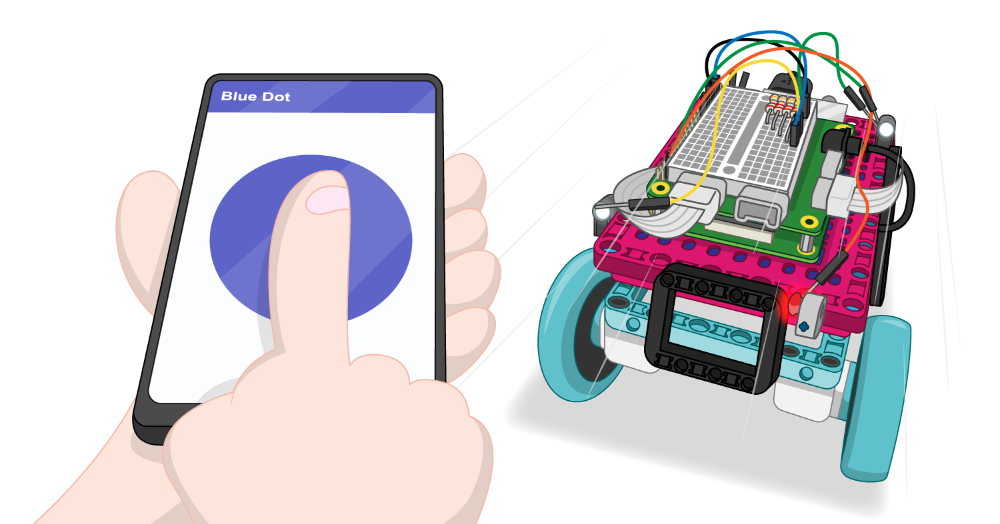

## What next?

### Improve the Pong game

Add even more randomness to the speed and trajectory of the ball.

Make the ball move faster as the game progresses.

Right now the game carries on forever — have a target score that a player must achieve in order to win and then start a new set of rounds. 

Change the scoring method to count how many times the players return the ball to one another, and reset when someone misses.

Introduce some haptic feedback, so that the motors turn a small amount when a point is lost.

At the moment it doesn't matter what part of the paddle connects with the ball, it will always bounce off at the same angle as it hit. Modify the collision code so that the angle becomes more obtuse if the ball makes contact close to the end of the paddle. 

### Create more games that use the LEGO® Technic™ motors as controllers

How about a game in the style of Angry Birds where two controllers are used to set the launch trajectory and the amount of force applied to the catapult?

If you are following the [Introduction to LEGO BuildHAT](https://projects.raspberrypi.org/en/pathways/lego-intro) pathway, you can move on to the [LEGO Robot Car](https://projects.raspberrypi.org/en/projects/lego-robot-car) project. In this project, you will make a LEGO Robot buggy controlled by Bluetooth!

