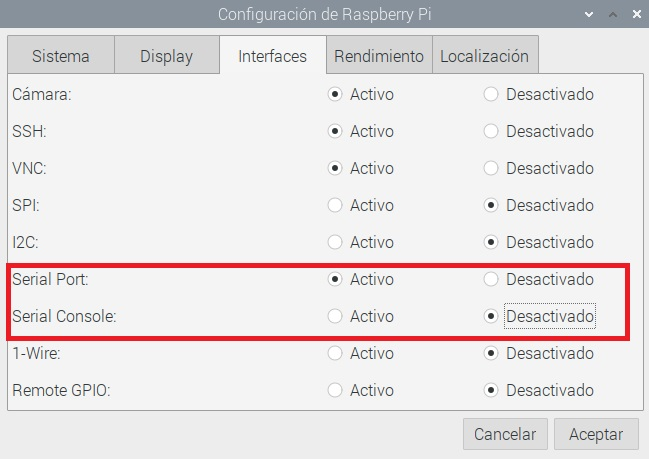

## Introducción

En este proyecto, utilizarás un HAT Raspberry Pi Build, un codificador de motor y una rueda LEGO® Technic ™, y la biblioteca Turtle de Python para hacer un controlador de juego simple que puedes usar para jugar Pong.

[Pong](https://en.wikipedia.org/wiki/Pong) es uno de los primeros videojuegos arcade, lanzado por primera vez en 1972 por Atari. Es un juego de tenis de mesa con gráficos simples en dos dimensiones. Los jugadores controlan paletas a cada lado de la pantalla, que usan para golpear una pelota de un lado al otro.

Vas a:
- Aprender a leer los grados de rotación de los motores LEGO® Technic ™
- Aprender a dibujar y mover gráficos de tortuga con motores LEGO® Technic ™
- Aprender a detectar colisiones entre gráficos usando coordenadas `x` e `y`

--- no-print ---

--- /no-print ---

--- print-only ---

--- /print-only ---

### Necesitarás

+ Una computadora Raspberry Pi
+ Un Build HAT Raspberry Pi
+ Al menos un motor LEGO® Technic ™
+ Variedad de LEGO®, incluidas las ruedas (utilizamos una selección del kit [LEGO® Education SPIKE ™ Prime](https://education.lego.com/en-gb/product/spike-prime))
+ Una pequeña placa de pruebas (opcional)
+ Una bocina (opcional)
+ Algunos cables de placa de prueba (opcional)
+ Una fuente de alimentación de 7,5 V con un conector de barril (opcional). Puedes usar una fuente de alimentación oficial de Raspberry Pi para este proyecto, ya que los codificadores del motor no usarán energía

### Software

+ Python 3
+ Biblioteca Build HAT de Python

--- collapse ---
---
title: Información adicional para educadores
---

Puedes descargar el proyecto completo [aquí](https://rpf.io/p/en/lego-game-controller-get){: target = "_ blank"}.

Si necesitas imprimir este proyecto, usa la [versión para imprimir](https://projects.raspberrypi.org/en/projects/lego-game-controller/print){:target="_blank"}.

--- /collapse ---

Antes de comenzar, deberás configurar tu computadora Raspberry Pi e instalar el Build HAT:

--- task ---

Mount your Raspberry Pi on to the LEGO Maker Plate using M2 bolts and nuts, making sure the Raspberry Pi is on the side without the 'edge':

 

--- /task ---

Montar la Raspberry Pi de esta manera permite un fácil acceso a los puertos, así como a la ranura de la tarjeta SD. The Maker Plate will allow you to connect the Raspberry Pi to the main structure of your dashboard more easily.

--- task ---

Alinea el Build HAT con la Raspberry Pi, asegurándote de que puedes ver la etiqueta `This way up`. Asegúrate de que todos los pines GPIO estén cubiertos por el HAT y presiona firmemente. (El ejemplo usa un encabezado de apilamiento {: target = "_ blank"}, lo que alarga los pines)

 

--- /task ---

Ahora debes encender tu Raspberry Pi utilizando el conector de barril de 7.5V en el Build HAT, lo cual te permitirá usar los motores.

--- task ---

Si aún no lo ha hecho, configura tu Raspberry Pi siguiendo estas instrucciones:

[Configurando tu Raspberry Pi](https://projects.raspberrypi.org/en/projects/raspberry-pi-setting-up){:target="_blank"}

--- /task ---

--- task ---

Una vez que la Raspberry Pi se haya iniciado, abre la herramienta de configuración de Raspberry Pi haciendo clic en el botón Menú de Raspberry y luego seleccionando "Preferencias" y luego "Configuración de Raspberry Pi".

Haz clic en la pestaña "interfaces" y ajusta la configuración Serie como se muestra a continuación:

--- /task ---

--- task ---

También necesitarás instalar la biblioteca buildhat de python siguiendo estas instrucciones:

--- collapse ---
---
title: Instala la biblioteca buildhat de Python
---

Abre una ventana de terminal en tu Raspberry Pi presionando <kbd>Ctrl</kbd>+<kbd>Alt</kbd>+<kbd>T</kbd>.

En el indicador, escribe: `sudo pip3 install buildhat`

Presiona <kbd>Entrar</kbd> y espera el mensaje "installation completed".

--- /collapse ---

--- /task ---
