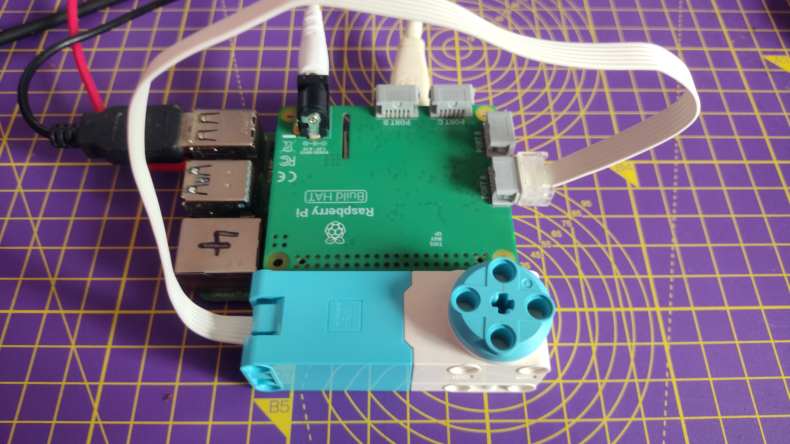
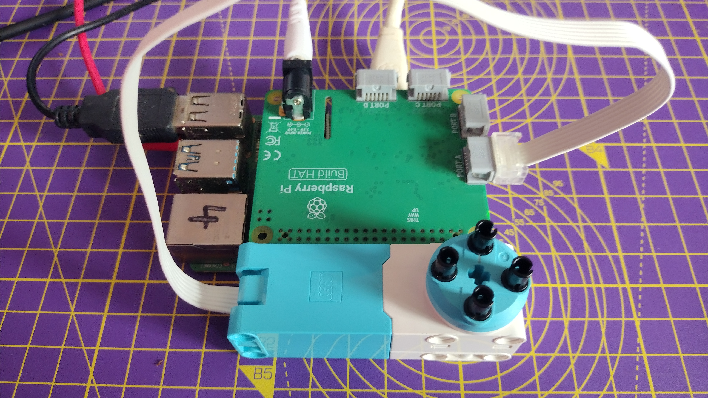
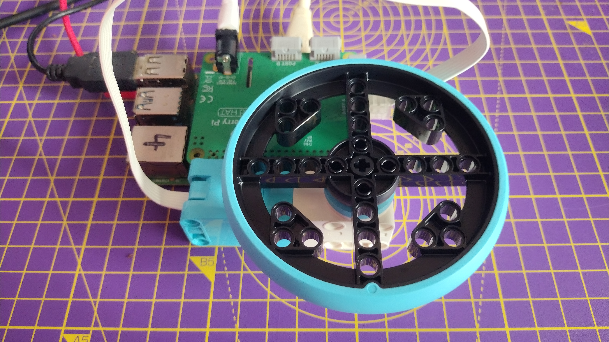
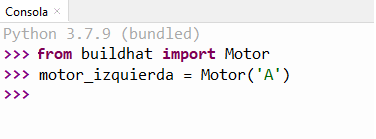

## Using LEGO® Spike™ motor encoders

Motor encoders can not only rotate, they can also accurately detect how many degrees they have been rotated.


The LEGO® Spike™ motors all have encoders. If you look at the rotating disk part of the motor, you will see a mark shaped like a lollipop that can be lined up with the 0 mark on the white body of the motor itself. This is the encoder set to zero degrees and any angular movement of the motor shaft can be measured relative to this point.

--- collapse ---
---
title: How motor encoders work
---

A motor encoder, also called a rotary or shaft encoder, is an electro-mechanical device that allows you to record the angular position or motion of the axle. It normally does this by converting the angular position to an analogue or digital output.

If a motor has an encoder, that means you can very accurately set the position of the axle. It also allows you to use the motor as an input device so that if something changes the position of the axle, this can be registered and used to trigger other actions in a computer program.

--- /collapse ---

--- task ---

Connect a monitor, keyboard, and mouse to your Raspberry Pi device.

Connect your Build HAT to your Raspberry Pi with the printed logo facing up, making sure that you have properly covered all the pins.

Lastly, connect the power; either though the Build HAT barrel jack or the USB-C port on the Raspberry Pi.

--- /task ---

--- task ---

Connect a motor to port A on the Build HAT.



--- /task ---

--- task ---

Attach a large wheel to the motor using four connector pegs. Turn the wheel so that the lollipop mark is in line with the zero.

 

--- /task ---

--- task ---

Open Thonny from the Raspberry Pi **Programming** menu and click on the **Shell** box at the bottom of the window.

--- /task ---

--- task ---

First, import the Build HAT library.

```python
from buildhat import Motor
```
Press Enter.

--- /task ---

--- task ---

Then, create a motor object that tells Python the motor is connected to port `A`. Type:

```python
motor_left = Motor('A')
```
Press Enter. (There will be a slight delay, be patient!)



--- /task ---

--- task ---

Now, you can ask the motor to report its **absolute** position. This will always be between `-180` and `180`.

```python
motor_left.get_aposition()
```

Depending on how well you positioned the motor at the start, you should get a value close to `0`.

Move the motor and type the line a second time, and see how the value changes.

--- /task ---

--- task ---

You can also keep track of the motor's **relative** position. This is how far it has moved from the time the program starts, so it will increase or decrease by `360` for every turn of the wheel.

```python
motor_left.get_position()
```
--- /task ---

--- task ---

Move the motor around and check its absolute and relative positions, so that you understand how the values change.

--- /task ---


