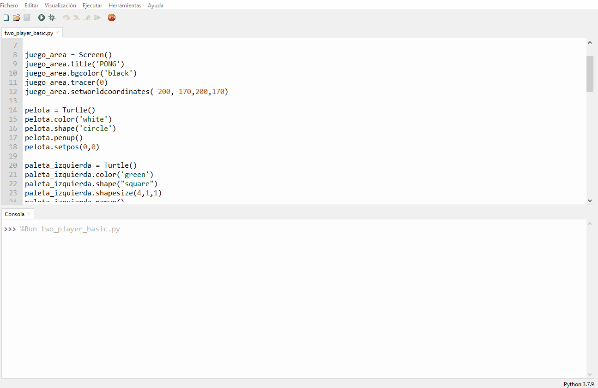

## Moviendo la pelota

La pelota va a rebotar en la pantalla, por lo que se necesitan dos variables para realizar un seguimiento de su velocidad en las direcciones `x` e `y`. Estos números pueden ser más grandes para hacer el juego más difícil o más pequeños para que el juego sea más fácil.

--- task ---

Añade estas líneas a tu programa:

--- code ---
---
language: python   
filename: pong.py   
line_numbers: true   
line_number_start: 23
line_highlights:
---

pelota.speed_x = 1   
pelota.speed_y = 1

--- /code ---

--- /task ---

Puedes verificar dónde se encuentra una tortuga usando `turtle.xcor()` y `turtle.ycor()` para encontrar `x` e `y`, respectivamente.

Entonces, para hacer que la pelota se mueva, puedes combinar la posición y la velocidad.

--- task ---

Añade estas líneas a tu programa:

--- code ---
---
language: python   
filename: pong.py   
line_numbers: true   
line_number_start: 27
line_highlights: 30, 31
---

while True:   
    juego_area.update()   
    pelota.setx(pelota.xcor() + pelota.speed_x)   
    pelota.sety(pelota.ycor() + pelota.speed_y)

--- /code ---

--- /task ---

¡Ejecuta el programa y ve qué sucede!

La pelota debe moverse en diagonal hacia arriba hacia la esquina superior derecha del área de juego... ¡y luego continuar! Si quieres que tu juego sea rápido y desafiante, puede aumentar los valores `speed_x` y `speed_y` para que la pelota se mueva más rápido.

La pelota debería rebotar en la pared superior en lugar de desaparecer de la pantalla. Para hacerlo, se puede invertir la velocidad haciendo que la bola viaje en sentido contrario, si su posición `y` es mayor que 160.

--- task ---

Agrega el siguiente código a tu bucle de juego y ejecútalo.

--- code ---
---
language: python   
filename: pong.py     
line_numbers: true   
line_number_start: 27
line_highlights: 32, 33
---

while True:   
    juego_area.update()   
    pelota.setx(pelota.xcor() + pelota.speed_x)   
    pelota.sety(pelota.ycor() + pelota.speed_y)   
    if pelota.ycor() > 160: 
        pelota.speed_y *= -1

--- /code ---

--- /task ---

--- task ---

Ejecuta tu programa nuevamente, y la pelota debería rebotar en la parte superior de la pantalla, pero desaparecer por la parte derecha de la pantalla.

--- /task ---

De la misma manera que el código verifica la posición superior `y` de la pelota, para hacerla rebotar, puedes verificar la posición derecha `x` y la posición inferior `y`, en tu bucle de juego.

--- task ---

Agrega estas verificaciones de la posición de la pelota.

--- code ---
---
language: python   
filename: pong.py   
line_numbers: true   
line_number_start: 32
line_highlights:
---

    if pelota.ycor() > 160:   
        pelota.speed_y *= -1   
    if pelota.xcor() > 195:   
        pelota.speed_x *= -1   
    if pelota.ycor() < -160:   
        pelota.speed_y *= -1

--- /code ---

--- /task ---

La pelota ahora debería rebotar alrededor de la pantalla y salirse por el borde izquierdo. A continuación, controlarás tu paleta para hacer rebotar la pelota desde el borde izquierdo.

--- save ---
