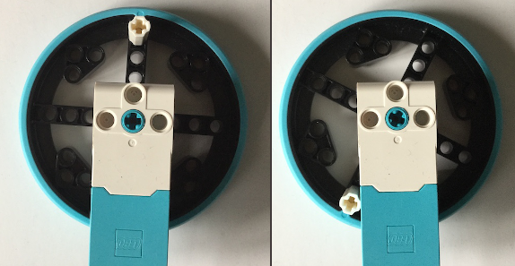
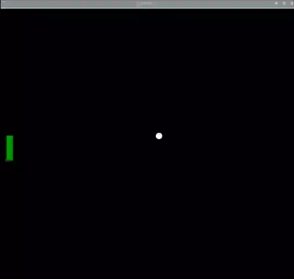

## Controlando la paleta

### Diseñando los controles

Utilizaremos el motor LEGO® Spike ™ para controlar la posición de la paleta, pero no querrás poder hacer giros completos.

Una forma sencilla de limitar el movimiento de la rueda es agregar un ladrillo LEGO® para evitar que la rueda gire por completo.

--- task ---

Alinea las marcas del codificador en su motor usando la rueda, como antes. Inserte una clavija o eje lo más cerca posible del nivel de los marcadores.

--- /task ---

--- print-only ---

--- /print-only ---

--- task ---

Agrega una línea para crear el objeto `motor_izquierda` después de la línea de importación.

--- code ---
---
language: python   
filename: pong.py   
line_numbers: true   
line_number_start: 3
line_highlights: 5
---

from buildhat import Motor

motor_izquierda = Motor ('A')

--- /code ---

--- /task ---

Ahora se necesita una nueva variable para realizar un seguimiento de la ubicación de la paleta. Se llamará `pos_izquierda` y tendrá valor `0`.

--- code ---
---
language: python   
filename: pong.py   
line_numbers: true   
line_number_start: 26
line_highlights: 29
---

pelota.speed_x = 0.4   
pelota.speed_y = 0.4

pos_izquierda = 0

--- /code ---

--- task ---

Crea una función para la paleta que se ejecutará cuando se mueva el codificador del motor. Ten en cuenta que utiliza una variable `global` para que pueda cambiar el valor de la variable `pos_izquierda`.

--- code ---
---
language: python   
filename: pong.py   
line_numbers: true   
line_number_start: 31
line_highlights:
---

def movido_izquierda(motor_speed, motor_rpos, motor_apos):   
    global pos_izquierda   
    pos_izquierda = motor_apos

--- /code ---

--- /task---

--- task ---

Ahora agrega una sola línea que usará esa función cada vez que se mueva el motor. Puede ser justo antes del bucle `while`.

--- code ---
---
language: python   
filename: pong.py   
line_numbers: true   
line_number_start: 35
line_highlights:
---

motor_izquierda.when_rotated = movido_izquierda

--- /code ---

--- /task ---

--- task ---

Luego, agrega una línea al bucle `while True` para actualizar el objeto paleta en la pantalla a la nueva posición.

--- code ---
---
language: python   
filename: pong.py   
line_numbers: true   
line_number_start: 45
line_highlights: 47
---

    if pelota.ycor() < -160:   
        pelota.speed_y *= -1   
    paleta_izquierda.sety(pos_izquierda)

--- /code ---

--- /task ---

--- task ---

Ejecuta tu código y luego gira la rueda en tu codificador de motor. Deberías ver tu paleta moviéndose hacia arriba y hacia abajo en la pantalla.

--- /task ---

En caso de que haya errores, tu código debería verse así:

--- code ---
---
language: python   
filename: pong.py   
line_numbers: true   
line_number_start:
line_highlights:
---

from turtle import *   
from time import sleep   
from buildhat import Motor

motor_izquierda = Motor ('A')

juego_area = Screen()   
juego_area.title('PONG')   
juego_area.bgcolor('black')   
juego_area.tracer(0)   
juego_area.setworldcoordinates(-200,-170,200,170)

pelota = Turtle()   
pelota.color('white')   
pelota.shape('circle')   
pelota.penup()   
pelota.setpos(0,0)

paleta_izquierda = Turtle()   
paleta_izquierda.color('green')   
paleta_izquierda.shape('square')   
paleta_izquierda.shapesize(4, 1, 1)   
paleta_izquierda.penup()   
paleta_izquierda.setpos(-190, 0)

pelota.speed_x = 0.4   
pelota.speed_y = 0.4

pos_izquierda = 0

def movido_izquierda(motor_speed, motor_rpos, motor_apos):   
    global pos_izquierda   
    pos_izquierda = motor_apos

motor_izquierda.when_rotated = movido_izquierda

while True:   
    juego_area.update()   
    pelota.setx(pelota.xcor() + pelota.speed_x)   
    pelota.sety(pelota.ycor() + pelota.speed_y)   
    if pelota.ycor() > 160: 
        pelota.speed_y *= -1   
    if pelota.xcor() > 195: 
        pelota.speed_x *= -1   
    if pelota.ycor() < -160:   
        pelota.speed_y *= -1   
    paleta_izquierda.sety(pos_izquierda)

--- /code ---

--- save ---