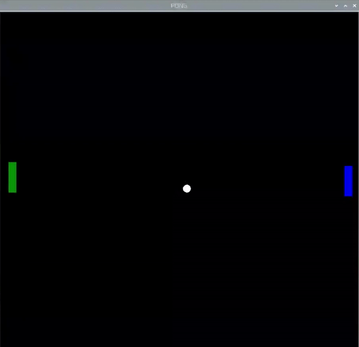

## Colisiones con la paleta

El juego está casi completo, pero primero debes agregar detección de colisión adicional que cubra la pelota que golpea la paleta.

--- task ---

Dentro del bucle `while True`, comprueba si la posición `x` de la pelota está en la línea horizontal cubierta por la paleta. También usa un `and` para verificar que la posición `y` de la pelota esté dentro del área horizontal en la que se mueve la paleta

--- code ---
---
language: python 
filename: pong.py   
line_numbers: true   
line_number_start: 47
line_highlights: 48
---

paleta_izquierda.sety(pos_izquierda)   
if (pelota.xcor() < -180 and pelota.xcor() > -190) and (pelota.ycor() < paleta_izquierda.ycor() + 20 and pelota.ycor() > paleta_izquierda.ycor() - 20): 
    pelota.setx(-180)  
    pelota.speed_x *= -1

--- /code ---

--- /task ---

Prueba el programa. ¡Deberías poder hacer rebotar la pelota en tu paleta y jugar un juego de 'squash' a solas!

Ahora que tienes una forma de evitar que la pelota desaparezca de la pantalla, es hora de pensar en lo que sucede si no logras atajarla.

Por ahora, reiniciemos la pelota al principio.

--- task ---

Agrega este código dentro del bucle `while True`:

--- code ---
---
language: python   
filename: pong.py   
line_numbers: true   
line_number_start: 52
line_highlights: 53-56
---

        pelota.speed_x *= -1   
    if pelota.xcor() < -195: #Izquierda
        pelota.hideturtle()   
        pelota.goto(0,0)   
        pelota.showturtle()

--- /code ---

--- /task ---

Una vez que estés satisfecho con las distintas configuraciones, es hora de agregar la segunda paleta.

Usando lo que has creado para la paleta de la izquierda como punto de partida, agrega una segunda paleta en el lado derecho del área de juego.

--- task ---

En primer lugar, conecta un segundo motor LEGO® Technic ™ al Build HAT (puerto B) y configúralo en el programa.

--- code ---
---
language: python   
filename: pong.py   
line_numbers: true   
line_number_start: 5
line_highlights: 6
---

motor_izquierda = Motor('A')   
motor_derecha = Motor('B')

--- /code ---

--- /task ---

--- task ---

Puedes copiar y pegar tu código para configurar tu paleta izquierda y cambiar el nombre y los valores de tu paleta derecha.

--- /task ---

--- task ---

Crea tu paleta derecha.

--- code ---
---
language: python   
filename: pong   
line_numbers: true   
line_number_start: 20
line_highlights: 27-32
---

paleta_izquierda = Turtle()   
paleta_izquierda.color('green')   
paleta_izquierda.shape('square')   
paleta_izquierda.shapesize(4, 1, 1)   
paleta_izquierda.penup()   
paleta_izquierda.setpos(-190, 0)

paleta_derecha = Turtle()   
paleta_derecha.color('blue')   
paleta_derecha.shape('square')   
paleta_derecha.shapesize(4, 1, 1)   
paleta_derecha.penup()   
paleta_derecha.setpos(190, 0)

--- /code ---

--- /task ---

--- task ---

Agrega una variable para la posición de la paleta derecha, una función para la paleta y la línea para llamar a la función cuando se mueve el motor derecho.

--- code ---
---
language: python   
filename: pong.py   
line_numbers: true   
line_number_start: 37
line_highlights: 38, 46-48, 52
---

pos_izquierda = 0   
pos_derecha = 0

def movido_izquierda(motor_speed, motor_rpos, motor_apos):   
    global pos_izquierda   
    pos_izquierda = motor_apos

def movido_derecha(motor_speed, motor_rpos, motor_apos):   
    global pos_derecha   
    pos_derecha = motor_apos

motor_izquierda.when_rotated = movido_izquierda   
motor_derecha.when_rotated = movido_derecha

--- /code ---

--- /task ---

--- task ---

Agrega una línea para actualizar la paleta en la pantalla al bucle`while True`:

--- code ---
---
language: python   
filename: pong.py   
line_numbers: true   
line_number_start: 64
line_highlights: 65
---

    paleta_izquierda.sety(pos_izquierda)   
    paleta_derecha.sety(pos_derecha)

--- /code ---

--- /task ---

En este momento, la pelota rebota en la pared de la derecha. Modifica las líneas de tu programa que hacen que eso suceda para que la pelota se reinicie en el centro.

--- task ---

Cambia la condición de la`xcor` de la pelota para que se reinicie.

--- code ---
---
language: python   
filename: pong.py   
line_numbers: true   
line_number_start: 60
line_highlights:
---

    if pelota.xcor() > 195:
        pelota.hideturtle()   
        pelota.goto(0,0)   
        pelota.showturtle()

--- /code ---

--- /task ---

--- task ---

Ahora agrega una condición para la paleta derecha similar a la que utilizaste en la izquierda, para manejar las colisiones.

--- code ---
---
language: python   
filename: pong.py   
line_numbers: true   
line_number_start: 68
line_highlights: 71-73
---

    if (pelota.xcor() < -180 and pelota.xcor() > -190) and (pelota.ycor() < paleta_izquierda.ycor() + 20 and pelota.ycor() > paleta_izquierda.ycor() - 20):
        pelota.setx(-180)
        pelota.speed_x *= -1   
    if (pelota.xcor() > 180 and pelota.xcor() < 190) and (pelota.ycor() < paleta_derecha.ycor() + 20 and pelota.ycor() > paleta_derecha.ycor() - 20):
        pelota.setx(180)
        pelota.speed_x *= -1

--- /code ---

--- /task ---

Ahora debería poder disfrutar de un juego básico de Pong para dos jugadores.

--- save ---
