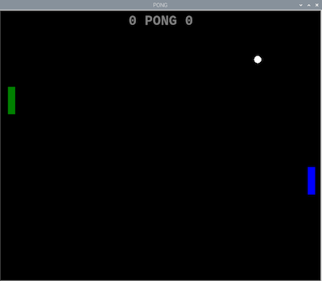
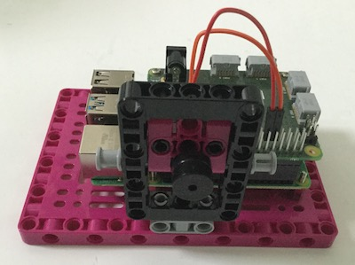

## Mejora tu proyecto

Hay algunas características adicionales que puedes agregar para terminar el juego.

### Añadir una puntuación

--- task ---

Seguir la puntuación mediante el uso de dos variables (una para cada jugador) y actualizarlas cada vez que alguien pierde.

--- hints ---
 --- hint ---

En primer lugar, declara las nuevas variables en algún lugar hacia el principio del programa y fija la puntuación inicial en cero.

```python   
puntos_d = 0
puntos_i = 0   
```

--- /hint --- --- hint ---

Cada vez que se pierda una pelota, aumenta en uno la variable de puntuación apropiada. Hay dos pruebas condicionales que deberás modificar.


--- /hint ---

--- hint ---

```python
    if pelota.xcor() > 195: #Derecha
        pelota.hideturtle()
        pelota.goto(0,0)
        pelota.showturtle()
        puntos_d+=1
    if pelota.xcor() < -195: #Izquierda
        pelota.hideturtle()
        pelota.goto(0,0)
        pelota.showturtle()
        puntos_i+=1
```

--- /hint ---

--- /hints --- --- /task ---

Ahora necesitas mostrar la puntuación en el área de juego. Puedes usar una cuarta tortuga para hacerlo.

--- task ---

Agrega lo que sigue a tu programa, después de la creación de las tortugas de las paletas y la pelota, pero antes del bucle `while True`.

```python
escritor = Turtle()
escritor.hideturtle()
escritor.color('grey')
escritor.penup()
style = ("Courier", 30, 'bold')
escritor.setposition(0,150)
escritor. write(f '{puntos_i} PONG {puntos_d}', font = style, align= 'center')
```

Puedes consultar la documentación de la biblioteca Turtle para ver qué otras opciones hay para mostrar texto.

--- /task ---

Si ejecutas el programa, la puntuación y la leyenda de Pong deberían aparecer, pero la puntuación no se actualizará.

--- task ---

Encuentra los dos condicionales para cada una de las situaciones de puntuación, cuando una paleta falla la pelota y desaparece hacia la izquierda o la derecha, y actualiza la puntuación volviendo a escribir el nuevo valor.

```python
     escritor.clear()
     escritor.write(f '{puntos_i} PONG {puntos_d}', font= style, align= 'center')
```

--- /task ---



### Agregar una bocina

Para incluir algunos efectos de sonido simples, conecta un altavoz a los pines GPIO en la Raspberry Pi.

[[[rpi-connect-buzzer]]]

En lugar de usar una placa de pruebas, puedes usar cables de puente con enchufes hembra en ambos extremos y meter las patas del altavoz en el enchufe. Luego, usa algunos elementos LEGO® para montar el altavoz para que no se caiga y se desconecte durante las frenéticas sesiones de juego.



--- task ---

Ahora agrega la biblioteca `gpiozero` a la lista de importaciones al inicio de tu programa:

```python
from gpiozero import Buzzer
```

Luego, haz que el timbre esté disponible para que lo use el programa configurando a qué pin has conectado la pata positiva (+). En este ejemplo, usamos el Pin 17.

```python
bocina = Buzzer(17)
```

Si no usaste el pin 17, cambia el valor para reflejar el pin al que está conectado tu altavoz.

--- /task ---

Ahora, siempre que la paleta y la pelota entren en contacto, querrás que el juego haga un sonido corto.

--- task ---

Agrega esta línea a cada parte de las condicionales para la detección de colisión `if` para la pelota y la paleta:

```python
bocina.beep(0.1,0.1,background=True)
```

Luego agrega una línea para reproducir un tono más largo cada vez que el jugador falla la pelota

```python
bocina.beep(0.5,0.5,background=True)
```

--- /task ---

Puedes leer más sobre las opciones disponibles con altavoces en la [documentación de GPIO Zero](https://gpiozero.readthedocs.io/es-ES/stable/api_output.html#buzzer).

### Personalizando tus controladores

En tu programa Turtle Python, has utilizado diferentes colores para las paletas. Puedes personalizar tus controladores LEGO® agregando ladrillos y otros elementos LEGO® del mismo color.


También puedes diseñar un asa para el motor para que sea más cómodo de sostener.


Tu juego ahora debería ser jugable. Diviértete con él antes de ver qué más puedes hacer a continuación.

--- save ---
