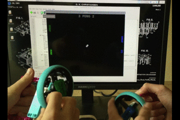
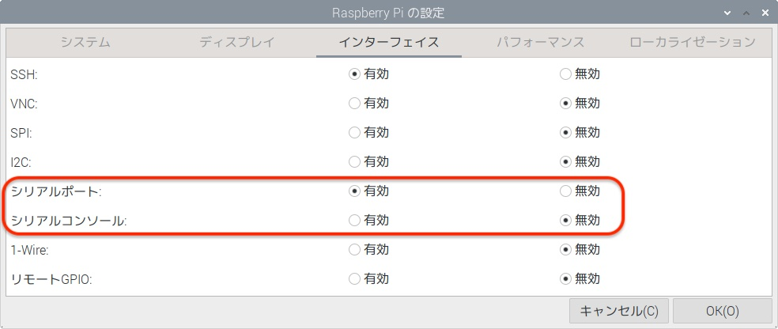

## はじめに

このプロジェクトでは、Raspberry Pi Build HAT、LEGO® Technic™モーターエンコーダーとホイール、Python Turtle ライブラリを使って、Pongをプレイできるシンプルなゲームコントローラーを作ります。

[Pong](https://ja.wikipedia.org/wiki/%E3%83%9D%E3%83%B3_(%E3%82%B2%E3%83%BC%E3%83%A0)) は、1972年にアタリが発表した最古のアーケードビデオゲームで、 シンプルな二次元の映像で表現された卓球ゲームです。 プレイヤーは両側のパドルを操作して、ボールを前後に打ちます。 プレイヤーは両側のパドルを操作して、ボールを前後に打ちます。

本項で学ぶこと:
- LEGO® Technic™ モーターから回転の度数を読み取る方法を学びます
- LEGO® Technic™ モーターを使ってTurtleグラフィックを描画したり移動する方法を学びます
- XとYの座標を使ってグラフィック同士の衝突を検出する方法を学びます

--- no-print ---

--- /no-print ---

--- print-only ---

--- /print-only ---

### 必要なもの

+ A Raspberry Pi 本体
+ Raspberry Pi Build HAT
+ LEGO® Technic™ モーター 少なくとも1つ
+ ホイールを含む LEGO® 製品 (本項では [LEGO® エデュケーション SPIKE™ プライムセット](https://education.lego.com/en-gb/product/spike-prime) を使用することを前提とします)
+ 小さいブレッドボード (任意)
+ ブザー (任意)
+ いくつかブレッドボード用のジャンパー線 (任意)
+ バレルジャックの7.5Vの電源アダプター (任意)。 モーターエンコーダーは電力を使わないので、このプロジェクトではRaspberry Piの公式電源サプライが使用できます。

### ソフトウェア

+ Python 3
+ Build HAT Python ライブラリ

--- collapse ---
---
title: 教育者向けの追加情報
---

完全なプロジェクトは [こちら](https://rpf.io/p/en/lego-game-controller-get){:target="_blank"} からダウンロードできます。

このプロジェクトの印刷版が必要なときは、 [印刷用のバージョン](https://projects.raspberrypi.org/en/projects/lego-game-controller/print){:target="_blank"} を使用してください。

--- /collapse ---

開始する前に、Raspberry Piのセットアップと、Build HATの装着をしてください:

--- task ---

M2のボルトとナットを使用して、 LEGO メイカープレートの上にRaspberry Piを取り付けます。 Raspberry Piはふちがない方の面に載せます:

 

--- /task ---

写真のとおりにRaspberry Piを固定することで、SDカードスロットが扱いやすくなります。 メイカープレートを使うことで、ダッシュボードのおもな構造により簡単に接続できます。

--- task ---

`This way up` の文字が見えるようにBuild HATをRaspberry Piと並べます。 全部のGPIOピンがHATにかぶるよう合わせて、しっかり押し下げてください。 (例ではピンが長くなる [スタッキングヘッダー](https://www.adafruit.com/product/2223){:target="_blank"}, を使用しています。 )

 

--- /task ---

モーターを使用するためには、Build HAT上のバレルジャックに7.5Vの電源を接続してRaspberry Piに電源を供給する必要があります。

--- task ---

まだRaspberry Piのセットアップが済んでいない場合は、次の手順に従ってセットアップしてください:

[Setting up your Raspberry Pi](https://projects.raspberrypi.org/en/projects/raspberry-pi-setting-up){:target="_blank"}

--- /task ---

--- task ---

Raspberry Piが起動したら、Raspberry Piメニューをクリックして“Preferences”と “Raspberry Pi Configuration”の順に選択して、Raspberry Pi Configuration toolを起動します。

“interfaces”タブをクリックして、シリアルの設定を以下のとおりに設定します:

--- /task ---

--- task ---

また、以下の手順に従って、buildhat pythonのインストールも必要になります。

--- collapse ---
---
title: buildhat Python ライブラリーのインストール
---

<kbd>Ctrl</kbd>+<kbd>Alt</kbd>+<kbd>T</kbd> を押して、Raspberry Pi上にターミナルウィンドウを開きます。

プロンプトに次の通り入力します: `sudo pip3 install buildhat`

<kbd>Enter</kbd> キーを入力して "installation completed" のメッセージが表示されるまで待ちます。

--- /collapse ---

--- /task ---
