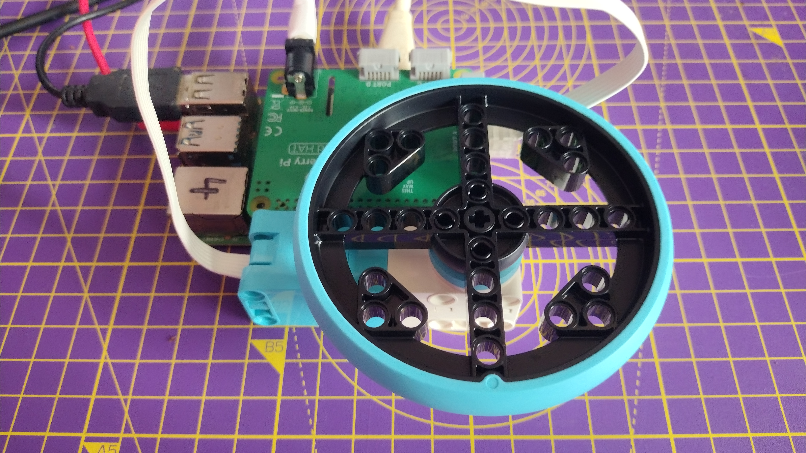

## LEGO® Spike™ モーターエンコーダーを使う

モーターエンコーダーは回転するだけではなく、何度回転したかを正確に検出することもできます。


LEGO®Spike™モーターにはすべてエンコーダーがついています。 モーターの、回転する円盤部分を見ると、ロリポップ（ペロペロキャンディ）のような模様がモーターの本体側にあるゼロマークと並んでいるのが見えます。 これがエンコーダーが0度に設定されている状態で、この状態を基準としてモーターシャフトが何度動いたかを測定できます。

--- collapse ---
---
title: モーターエンコーダーのしくみ
---

モーターエンコーダー（もしくはロータリーエンコーダー、シャフトエンコーダー）は、電気機械式のデバイスで、軸の角度の位置や動きを記録できます。 通常は角度の位置をアナログかデジタルに変換して出力します。

モーターがエンコーダーを搭載している場合、軸の位置を非常に正確にセットできるということになります。 また、モーターを入力デバイスとしても使えるため、何かによって軸の位置が変更された時にそれを記録したりトリガーにしてコンピュータープログラムで他の動作をさせたりすることができます。

--- /collapse ---

--- task ---

モニター、キーボード、マウスをRaspberry Piに接続します。

Build HATにプリントされたロゴを上にした状態で、すべてのGPIOピンにきちんとかぶせるようにしてRaspberry Piに接続します。

最後に、Build HATのバレルジャックかRaspberry PiのUSB-Cのどちらかに電源を接続します。

--- /task ---

--- task ---

モーターをBuild HATのポートAに接続します。


--- /task ---

--- task ---

4つのコネクターペグを使って、モーターに大きなホイールを取り付けます。 ホイールを回して、ロリポップマークをゼロに並べます。

 

--- /task ---

--- task ---

Raspberry Piの **プログラミング** メニューからThonnyを開き、ウィンドウの下にある **Shell** のボックスをクリックします。

--- /task ---

--- task ---

はじめに、Build HATのライブラリーをインポートします。

```python
from buildhat import Motor
```
Enterキーを入力します。

--- /task ---

--- task ---

続けて、モーターがポート `A` に接続されていることをPythonに知らせるモーターオブジェクトを次のように作成します: 最後にまたコマンドを入力してください。

```python
motor_left = Motor('A')
```
Enterキーを入力します。 (実行に少し時間がかかります。 我慢しましょう!)

--- /task ---

--- task ---

これで、モーターが返す **絶対** 位置を問い合わせることができます。 これは常に `-180` から `180` の間の数値になります。

```python
motor_left.get_aposition()
```

最初にモーターの位置合わせがどの程度しっかりできたか次第では `0` に近い値が取得できるはずです。

モーターを動かして再びコマンドを入力し、値の変化を確認します。

--- /task ---

--- task ---

モーターの **相対** 位置も追跡できます。 プログラムがスタートしてからの移動量となるため、たとえばホイールを1周させるたびに `360` ずつ増減します。

```python
motor_left.get_position()
```
--- /task ---

--- task ---

モーターを動かして、絶対位置と相対位置それぞれで値がどのような変化をするか理解しましょう。

--- /task ---


