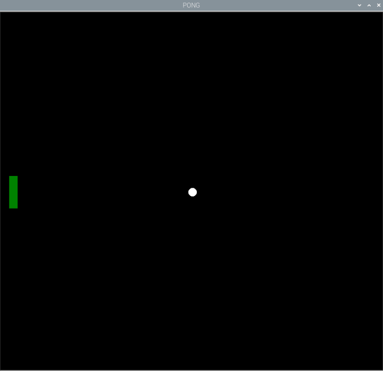

## Pongの画面を作る

Turtle は描画とアニメーションのためのライブラリーで、詳細はこの[素敵なプロジェクト](https://projects.raspberrypi.org/ja-JP/projects/turtle-race)から学ぶことができます。

はじめに、ゲームをプレイするためのウィンドウを作成します。

--- task ---

Thonnyで新しいファイルを開き、Turtle・time・Build HATをインポートして画面をセットアップするためのコードを次のとおりに追加します。 ファイルを実行すると、 "PONG" というタイトルの黒いウィンドウが開かれるはずです。 なお、 `#` コメントは含めなくても大丈夫です。

--- code ---
---
language: python   
filename: pong.py   
line_numbers: true   
line_number_start: 1
line_highlights:
---

from turtle import Screen, Turtle
from time import sleep 
from buildhat import Motor   

game_area = Screen() #画面を作成する   
game_area.title("PONG") #画面のタイトルを設定する   
game_area.bgcolor('black') #背景色を設定する   
game_area.tracer(0) #アニメーションをよりスムーズにするための設定

--- /code ---

--- /task ---

Turle ライブラリには画面の領域に座標を設定する便利な方法があります。 次の1行をプログラムに追加してください:

--- task ---

--- code ---
---
language: python   
filename: pong.py   
line_numbers: true   
line_number_start: 8
line_highlights: 9
---

game_area.tracer(0)   
game_area.setworldcoordinates(-200, -170, 200, 170)

--- /code ---

--- /task ---

この行によって、中心を0とした、幅400ピクセル、高さ340ピクセルの画面が作成されます。

--- task ---

次に、パドルとボールを表示するために、ゲーム領域を更新しましょう。 **ゲームループ** をコードの最後に追加して、 `update()` メソッドを呼び出します。

--- code ---
---
language: python   
filename: pong.py   
line_numbers: true   
line_number_start: 10
line_highlights:
---

while True:   
    game_area.update()

--- /code ---

コードを実行すると、黒い画面が表示されます。

--- /task ---

--- task ---

続けて、白い円を置くためにTurtleを使ってボールを作成しましょう。 ボールは画面の真ん中からスタートし、動く時に線を引かないようにする必要があります。

`while True` ループの **前** に次のコードを追加します:

--- code ---
---
language: python   
filename: pong.py   
line_numbers: true   
line_number_start: 10
line_highlights:
---

ball = Turtle()   
ball.color('white')   
ball.shape('circle')   
ball.penup()   
ball.setpos(0,0)

while True:

--- /code ---

--- /task ---

--- task ---

もう一度コードを実行しましょう。 白いボールが画面の中央に表示されるのが確認できるでしょう。

--- /task ---

--- task ---

次に、パドルも同じようにして配置しましょう。 パドルは緑色の四角で、画面の左端に配置します。

--- code ---
---
language: python   
filename: pong.py   
line_numbers: true   
line_number_start: 17
line_highlights:
---

paddle_left = Turtle()   
paddle_left.color('green')   
paddle_left.shape('square')   
paddle_left.shapesize(4, 1, 1)   
paddle_left.penup()   
paddle_left.setpos(-190, 0)

--- /code ---

--- /task ---

--- task ---

コードを実行して、ボールとパドルが表示されることを確認します。

--- /task ---
