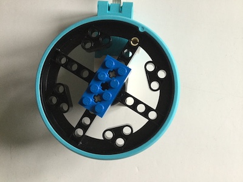

## 作品を改善する

ゲームづくりを終える前に、もう少しだけ機能を付け足してみましょう。

### スコアを追加する

--- task ---

2つの変数 (各プレイヤーに1つずつ) を使ってスコアを記録して、ラウンドが終わるたびにそれらを更新します。

--- hints --- --- hint ---

はじめに、プログラムの冒頭で新しい変数を宣言して、初期スコアを0に設定します。

```python   
score_r = 0   
score_l = 0   
```

--- /hint --- --- hint ---

ボールを逃した時には、どちらか適切なスコア変数を1つ加算します。 2つの条件チェックを書き換える必要があります。


--- /hint ---

--- hint ---

```python
    if ball.xcor() > 195: #Right
        ball.hideturtle()
        ball.goto(0,0)
        ball.showturtle()
        score_r+=1
    if ball.xcor() < -195: #Left
        ball.hideturtle()
        ball.goto(0,0)
        ball.showturtle()
        score_l+=1
```

--- /hint ---

--- /hints --- --- /task ---

次に、ゲーム内にスコアを表示する必要があります。 これを実現するには4つめのTurtleを使います。

--- task ---

パドルとボールのTurtleを作成したあとでかつ`while True`ループの前に、次のプログラムを追記します。

```python
writer = Turtle()
writer.hideturtle()
writer.color('grey')
writer.penup()
style = ("Courier",30,'bold')
writer.setposition(0,150)
writer.write(f'{score_l} PONG {score_r}', font=style, align='center')
```

他のテキスト表示方法を確認するには、Turtleライブラリのドキュメントを見てください。

--- /task ---

この時点でプログラムを実行すると、スコアとPongの文字が表示されますが、スコア自体は更新されません。

--- task ---

ボールがパドルから外れて左または右に消えた時の2つの条件を見つけて、スコアリングの状況に応じて新しい値を書き直してスコアを更新します。

```python
     writer.clear()
     writer.write(f'{score_l} PONG {score_r}', font=style, align='center')
```

--- /task ---


### ブザーを追加する

いくつかのかんたんな効果音を含めるために、ブザーをRaspberry PiのGPIOに接続しましょう。

[[[rpi-connect-buzzer]]]

ブレッドボードを使用する代わりに、両端がメスソケットのジャンパーリードを使ってブザーの脚をソケットに差し込むこともできます。 その際には、いくつかのLEGO®の要素を使用してブザーを固定して、ゲームセッション中にブザーが外れて切断されないようにします。


--- task ---

それでは、`gpiozero`ライブラリをプログラムの冒頭にあるインポートリストに追加しましょう:

```python
from gpiozero import Buzzer
```

次に、プラス (+) の脚を接続したピン番号を設定して、プログラムでブザーを使えるようにします。 次の例では17番のピンを使用しています。

```python
buzz = Buzzer(17)
```

17番ではないピンを使ったときは、ブザーが接続されているピンに合わせて値を変更してください。

--- /task ---

パドルとボールが接触するたびに、短いトーンをゲームで鳴らすようにします。

--- task ---

ボールとパドルがそれぞれ衝突したことを検出する`if`文に、次の行を追加します:

```python
buzz.beep(0.1,0.1,background=True)
```

次に、プレーヤーがボールを逃したときはトーンを長めに再生するように、次の行を追加します。

```python
buzz.beep(0.5,0.5,background=True)
```

--- /task ---

ブザーが利用可能なオプションの詳細は、[GPIO Zeroのドキュメント](https://gpiozero.readthedocs.io/en/stable/api_output.html#buzzer)を参照してください。

### コントローラーをカスタマイズする

今回のPython Turtleプログラムでは、パドルにそれぞれ違う色を使いました。 それと同じ色のブロックや他のLEGO®の要素をLEGO®コントローラーに追加してカスタマイズできます。



モーターのハンドルを設計して、より持ちやすくすることもできます。


これで、ゲームをプレイできるようになります。 次に何ができるかを見る前に、ゲームを楽しみましょう。

--- save ---
