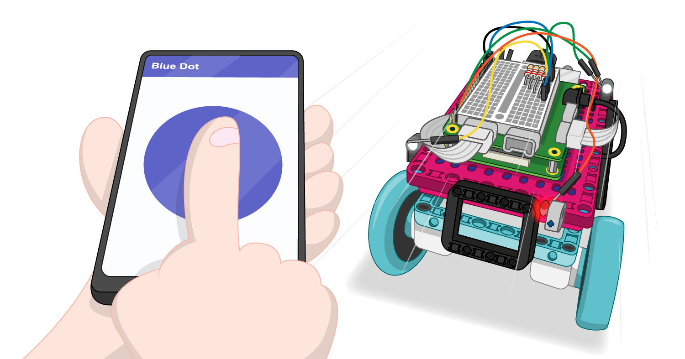

## 次は何をしますか？

### Pongゲームを改良する

ボールの速度と弾道にさらにランダム性を加えます。

ゲームが進むごとにボールをより速く動かします。

現在はゲームはずっと続くので、新しいラウンドのセットを始めるために、プレイヤーにスコアのノルマを課します。

スコアリングの方法を変更して、プレイヤーがボールを互いに返した回数をカウントし、誰かがミスしたらリセットします。

ポイントが失われたときにモーターが少し回転させる触覚フィードバックを実装します。

今はパドルのどの部分がボールに当たっているかは関係なく、当たれば常に同じ角度で跳ね返ります。 衝突時のコードを書き換えて、ボールがパドルの端に触れたときには角度がより鈍くなるようにします。

### LEGO® Technic™をコントローラーとして使うゲームをもっと作る

2つのコントローラーを使用して、発射する軌道とカタパルトに加えられる力の量を決めるAngryBirdsスタイルのゲームはどうでしょう？

[LEGO BuildHATの紹介](https://projects.raspberrypi.org/ja-JP/pathways/lego-intro)のパスに沿って進めている場合は、[LEGOロボットカー](https://projects.raspberrypi.org/ja-JP/projects/lego-robot-car)のプロジェクトに進むことができます。 このプロジェクトでは、Bluetoothで制御できるLEGOロボットのバギーを作成します！

***

このプロジェクトは以下のボランティアによって翻訳されました。

Akira Ouchi

ボランティアのおかげで、世界中の人々に母国語で学ぶ機会を与えることができます。翻訳を引き受けていただくことで、より多くの人々に手を差し伸べることができます。詳しくは [rpf.io/translate](https://rpf.io/translate) をご覧ください。