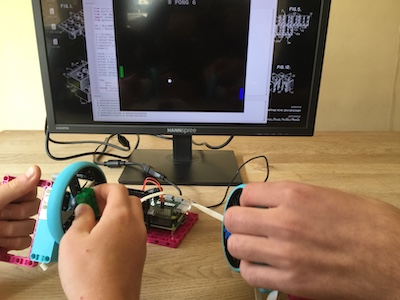

## 들어가며

이 프로젝트에서는 Raspberry Pi Build HAT, LEGO® Technic™ 모터 인코더 및 휠, Python Turtle 라이브러리를 사용하여 Pong 게임에 사용할 수 있는 간단한 게임 컨트롤러를 만들 것입니다.

[Pong](https://ko.wikipedia.org/wiki/%ED%90%81) 는 1972년 Atari에서 출시된 최초의 스포츠 아케이드 비디오 게임 중 하나입니다. 퐁 게임은 단순한 2D 그래픽이 특징인 탁구 게임입니다. 플레이어는 화면 양쪽에 있는 패들을 제어하여, 공을 앞뒤로 치는 데 사용합니다.

여러분은:
- LEGO® Technic™ 모터들의 회전 각도를 읽는 방법 알아보기
- LEGO® Technic™ 모터를 사용하여 거북이 그래픽을 그리고 움직이는 방법을 배우기
- `x` 및 `y` 좌표를 사용하여 그래픽 간의 충돌을 감지하는 방법 배우기

--- no-print ---

--- /no-print ---

--- print-only ---

--- /print-only ---

### 구현하기 위해 필요한 내용

+ Raspberry Pi
+ 라즈베리 파이 Build HAT
+ 1개 이상의 LEGO® Technic™ 모터
+ 바퀴 2개를 포함한 다양한 LEGO®([LEGO® Education SPIKE™ Prime 키트](https://education.lego.com/en-gb/product/spike-prime)에서 선택 사용)
+ 작은 브레드보드(선택)
+ 부저(선택)
+ 몇 개의 브레드보드 점퍼 리드(선택)
+ 배럴 잭이 있는 7.5V 전원 공급 장치 (선택) 모터 인코더는 전원을 사용하지 않으므로 이 프로젝트에 공식 Raspberry Pi 전원 공급 장치를 사용할 수 있습니다.

### 소프트웨어

+ Python 3
+ Build HAT Python library

--- collapse ---
---
title: 교육자를 위한 추가 정보
---

완성 된 프로젝트는 [여기](https://rpf.io/p/en/lego-game-controller-get){:target="blank"} 에서 다운로드 할 수 있습니다.

이 프로젝트를 인쇄한다면 [프린트용 버전](https://projects.raspberrypi.org/en/projects/lego-game-controller/print){:target="_blank"}을 사용해 주십시오.

--- /collapse ---

시작하기 전에 Raspberry Pi 컴퓨터를 설정하고 Build HAT를 연결해야 합니다.

--- task ---

M2 볼트와 너트를 사용하여 LEGO Maker Plate에 Raspberry Pi를 장착하고 Raspberry Pi가 '가장자리' 쪽에 없는지 꼭 확인합니다.

 

--- /task ---

Mounting the Raspberry Pi this way round enables easy access to the ports as well as the SD card slot. Maker Plate를 사용하면 Raspberry Pi를 대시보드에 더 쉽게 연결할 수 있습니다.

--- task ---

Build HAT를 Raspberry Pi와 정렬하여 `This way up` 레이블이 보이도록 합니다. 모든 GPIO 핀이 HAT로 덮여 있는지 확인하고 단단히 눌러주세요. (이 예시에서는 [스택 헤더](https://www.adafruit.com/product/2223){:target="_blank"}을 사용하므로 핀이 더 길어집니다.)

 

--- /task ---

이제 Build HAT의 7.5V 배럴 잭을 사용하여 Raspberry Pi에 전원을 공급해야 합니다. 그러면 이제부터 모터를 사용할 수 있습니다.

--- task ---

아직 설정하지 않았다면 다음 지침에 따라 Raspberry Pi를 설정하세요.

[Setting up your Raspberry Pi](https://projects.raspberrypi.org/en/projects/raspberry-pi-setting-up){:target="_blank"}

--- /task ---

--- task ---

Raspberry Pi가 부팅되면 Raspberry 메뉴 버튼을 클릭하고 "기본 설정(Preferences)"를 선택한 다음 "Raspberry Pi Configuration"을 선택하여 Raspberry Pi Configuration 도구를 엽니다.

Click on the “interfaces” tab and adjust the Serial settings as shown below:

--- /task ---

--- task ---

또한 다음 지침에 따라 buildhat python 라이브러리를 설치해야 합니다:

--- collapse ---
---
title: buildhat Python 라이브러리 설치
---

<kbd>Ctrl</kbd>+<kbd>Alt</kbd>+<kbd>T</kbd>를 눌러 Raspberry Pi에서 터미널 창을 엽니다.

커맨드 창에서 다음을 입력합니다: `sudo pip3 install buildhat`

<kbd>Enter</kbd> 를 누르고 "설치 완료" 메시지를 확인합니다.

--- /collapse ---

--- /task ---
