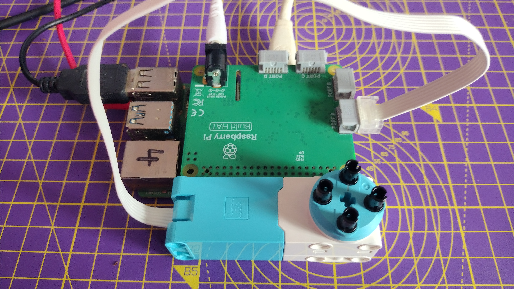

## Use LEGO® Spike™ motor encoders

모터 인코더는 회전할 수 있을 뿐만 아니라 회전이 이루어진 각도를 정확하게 감지할 수도 있습니다.


LEGO® Spike™ 모터에는 전부 인코더가 있습니다. 모터의 회전하는 디스크 부분을 보면, 모터 자체의 흰색 몸체에 0 표시와 일직선이 될 수 있는 막대 사탕 모양의 표시가 있는 것을 볼 수 있습니다. 이것은 0도로 설정된 인코더이며 이 지점을 기준으로 모터 샤프트의 모든 각도 움직임을 측정할 수 있습니다.

--- collapse ---
---
title: 어떻게 동작하나요?
---

로터리 또는 샤프트 인코더 라고도 하는 모터 인코더는 축의 각도 위치 또는 동작을 기록할 수 있는 장치입니다. 일반적으로 각도를 아날로그 또는 디지털 출력으로 변환하는 작업을 수행합니다.

모터에 인코더가 있으면 액슬의 위치를 매우 정확하게 설정할 수 있습니다. 또한 모터를 입력 장치로 사용할 수 있으므로 액슬의 위치가 변경된 경우 등록하여 컴퓨터 프로그램에서 다른 작업을 트리거하는 데 사용할 수 있습니다.

--- /collapse ---

--- task ---

모니터, 키보드, 마우스를 Raspberry Pi 장치에 연결합니다.

Build HAT 내 인쇄된 로고가 위를 향하도록 하여 Raspberry Pi에 연결하고 모든 핀을 제대로 덮었는지 확인합니다.

마지막으로 Build HAT 배럴 잭 또는 Raspberry Pi의 USB-C 포트를 통해 전원을 연결합니다.

--- /task ---

--- task ---

Build HAT의 포트 A에 모터를 연결하세요.


--- /task ---

--- task ---

4개의 커넥터 페그를 사용하여 모터에 큰 바퀴를 부착하세요. 롤리팝 표시가 0과 일치하도록 바퀴를 돌리세요.

 

--- /task ---

--- task ---

Open Thonny from the Raspberry Pi **Programming** menu and click on the **Shell** box at the bottom of the window.

--- /task ---

--- task ---

먼저, Build HAT 라이브러리를 import하세요.

```python
from buildhat import Motor
```
Enter 키를 누르세요.

--- /task ---

--- task ---

그런 다음 Python에 모터가 포트 `A`에 연결되었음을 알리는 모터 객체를 만듭니다. 유형:

```python
motor_left = Motor('A')
```
Enter 키를 누르세요. (약간 시간이 걸릴 수 있으니 조금만 기다려주세요!)

--- /task ---

--- task ---

**절대적** 위치를 보고하도록 지시를 내릴 수도 있습니다. absolute 위치는 항상 `-180` 과 `180` 사이 입니다.

```python
motor_left.get_aposition()
```

시작 시 모터를 얼마나 잘 배치했는지에 따라 `0`에 가까운 값을 얻어야 합니다.

모터를 돌리고, 라인을 두 번째로 입력하고 값이 어떻게 변하는지 확인합니다.

--- /task ---

--- task ---

**상대적** 위치도 추적할 수 있습니다. 이것은 프로그램이 시작된 이후로 얼마나 회전했는지 보여주므로, `360`도로 바퀴가 회전할 때마다 표시됩니다.

```python
motor_left.get_position()
```
--- /task ---

--- task ---

모터를 이리저리 움직이고 절대 및 상대 위치를 확인하여 값이 어떻게 변하는지 이해해 보세요.

--- /task ---


