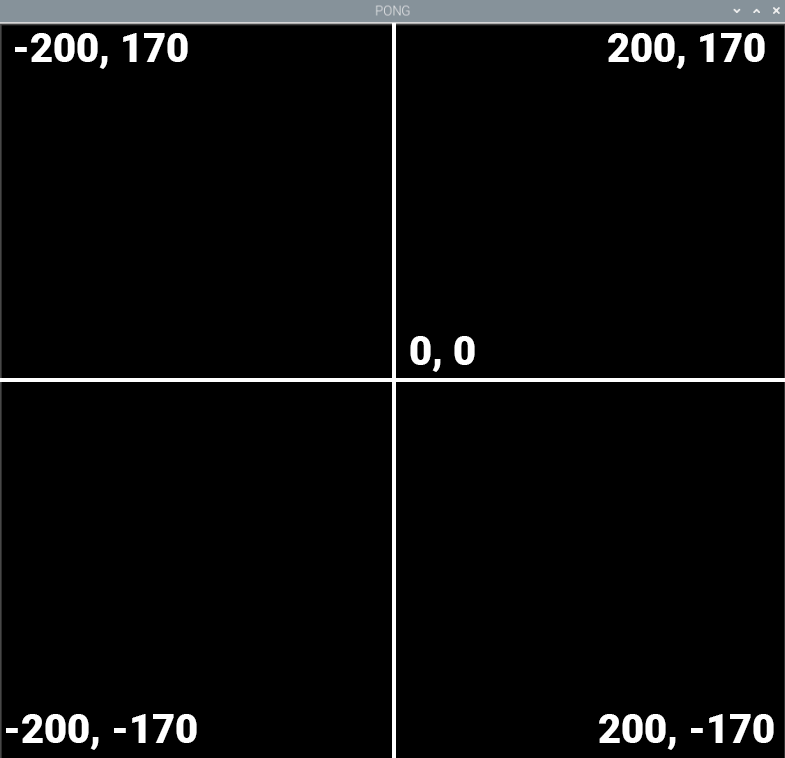

## Pong 화면 만들기

Turtle은 그림 및 애니메이션 라이브러리이며 이 [우수한 프로젝트](https://projects.raspberrypi.org/en/projects/turtle-race)를 통해 더 자세히 알아볼 수 있습니다.

먼저 게임이 실행될 창을 만드세요.

--- task ---

Thonny에서 새 파일을 열고 다음 코드를 추가하여 Turtle, 시간, Build HAT 라이브러리를 가져온 후 화면 설정합니다. 파일을 실행하면 "PONG" 이라는 제목의 검은색 창이 열려 있어야 합니다. 아래에 기재된 `#` 주석은 포함할 필요가 없습니다.

--- code ---
---
language: python   
filename: pong.py   
line_numbers: true   
line_number_start: 1
line_highlights:
---

from turtle import Screen, Turtle from time import sleep from buildhat import Motor

game_area = Screen() #스크린 만들기   
game_area.title("PONG") #스크린 제목 만들기   
game_area.bgcolor('black') #배경 색상 설명   
game_area.tracer(0) #부드러운 애니메이션 설정

--- /code ---

--- /task ---

Turtle 라이브러리에는 화면 영역의 좌표를 설정하는 유용한 방법도 있습니다. 다음 코드를 당신의 프로그램에 추가해 보세요:

--- task ---

--- code ---
---
language: python   
filename: pong.py   
line_numbers: true   
line_number_start: 8
line_highlights: 9
---

game_area.tracer(0)   
game_area.setworldcoordinates(-200, -170, 200, 170)

--- /code ---

--- /task ---

이렇게 하면 너비가 400픽셀, 높이가 340픽셀인 직사각형 창 중앙에 0이 생성됩니다.

--- task ---

이제 패들과 공을 보기 위해서는, 게임 영역을 업데이트해야 합니다. 코드 맨 아래에 **game loop** 를 추가하고, `update()` 메서드를 호출합니다.

--- code ---
---
language: python   
filename: pong.py   
line_numbers: true   
line_number_start: 10
line_highlights:
---

while True:   
game_area.update()

--- /code ---

코드를 실행하고 검은색 창이 나타나는 것을 확인하세요.

--- /task ---

--- task ---

다음으로, 흰색 원으로 설정된 Turtle을 사용하여 공을 만들 수 있습니다. 공은 화면 중앙에서 시작해야 하며 움직일 때 선을 그리지 않도록 설정해야 합니다.

`while True` 루프 **위**에 다음 코드를 추가하세요:

--- code ---
---
language: python   
filename: pong.py   
line_numbers: true   
line_number_start: 10
line_highlights:
---

ball = Turtle()   
ball.color('white')   
ball.shape('circle')   
ball.penup()   
ball.setpos(0,0)

while True:

--- /code ---

--- /task ---

--- task ---

코드를 다시 테스트 해 보세요. 프로그램 창에 흰색 공이 표시되어야 합니다.

--- /task ---

--- task ---

다음으로 동일한 방법으로 패들을 설정할 수 있습니다. 녹색 사각형이며 화면의 가장 왼쪽에 위치할 것입니다.

--- code ---
---
language: python   
filename: pong.py   
line_numbers: true   
line_number_start: 17
line_highlights:
---

paddle_left = Turtle()   
paddle_left.color('green')   
paddle_left.shape('square')   
paddle_left.shapesize(4, 1, 1)   
paddle_left.penup()   
paddle_left.setpos(-190, 0)

--- /code ---

--- /task ---

--- task ---

코드를 실행하면, 공과 패들이 보일 것입니다.

--- /task ---
