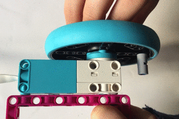

## 패들 제어하기

### 컨트롤 디자인하기

LEGO® Spike™ 모터는 패들의 위치를 제어하는 데 사용되지만 모터를 완전히 회전하는 것은 원하지 않습니다.

바퀴의 움직임을 제한하는 간단한 방법은 바퀴가 완전히 회전하는 것을 방지하기 위해 LEGO® element를 추가하는 것입니다.

--- task ---

이전과 같이 휠을 사용하여 모터의 인코더 표시를 정렬하도록 합니다. 가능한 한 마커와 수평에 가깝게 못이나 축을 삽입하세요.

--- /task ---

--- print-only ---

--- /print-only ---

--- task ---

import 라인 뒤에 `motor_left` 객체를 생성하는 라인을 추가합니다.

--- code ---
---
language: python   
filename: pong.py   
line_numbers: true   
line_number_start: 3
line_highlights: 5
---

from buildhat import Motor

motor_left = Motor('A')

--- /code ---

--- /task ---

이제 패들의 위치를 추적하기 위해 새로운 변수가 필요합니다. 이것은 `pos_left`로, `0` 으로 설정됩니다.

--- code ---
---
language: python   
filename: pong.py   
line_numbers: true   
line_number_start: 26
line_highlights: 29
---

ball.speed_x = 0.4   
ball.speed_y = 0.4

pos_left = 0

--- /code ---

--- task ---

모터 인코더가 움직일 때 실행할 패들에 대한 함수를 만드세요. 주의할 점은 이 변수는 `전역`변수이며, `pos_left`라는 이름을 가지며, 아래와 같이 변수값을 변경할 수 있습니다.

--- code ---
---
language: python   
filename: pong.py   
line_numbers: true   
line_number_start: 31
line_highlights:
---

def moved_left(motor_speed, motor_rpos, motor_apos):   
global pos_left   
pos_left = motor_apos

--- /code ---

--- /task---

--- task ---

이제 모터가 움직일 때마다 해당 기능을 사용할 단일 라인을 추가하세요. `while` 루프 바로 앞에 올 수 있습니다.

--- code ---
---
language: python   
filename: pong.py   
line_numbers: true   
line_number_start: 35
line_highlights:
---

motor_left.when_rotated = moved_left

--- /code ---

--- /task ---

--- task ---

`while True` 루프에 라인을 추가하여 화면의 패들 객체를 새 위치로 업데이트합니다.

--- code ---
---
language: python   
filename: pong.py   
line_numbers: true   
line_number_start: 45
line_highlights: 47
---

    if ball.ycor() < -160:   
        ball.speed_y *= -1   
    paddle_left.sety(pos_left)

--- /code ---

--- /task ---

--- task ---

코드를 실행한 다음 모터 인코더의 휠을 돌리세요. 패들이 화면 위 아래로 움직이는 것을 볼 수 있습니다.

--- /task ---

오류가 난 경우에는, 코드는 현재 다음과 같아야 합니다:

--- code ---
---
language: python   
filename: pong.py   
line_numbers: true   
line_number_start:
line_highlights:
---

from turtle import *   
from time import sleep   
from buildhat import Motor

motor_left = Motor('A')

game_area = Screen()   
game_area.title('PONG')   
game_area.bgcolor('black')   
game_area.tracer(0)   
game_area.setworldcoordinates(-200,-170,200,170)

ball = Turtle()   
ball.color('white')   
ball.shape('circle')   
ball.penup()   
ball.setpos(0,0)

paddle_left = Turtle()   
paddle_left.color('green')   
paddle_left.shape("square")   
paddle_left.shapesize(4,1,1)   
paddle_left.penup()   
paddle_left.setpos(-190,0)

ball.speed_x = 0.4   
ball.speed_y = 0.4

pos_left = 0

def moved_left(motor_speed, motor_rpos, motor_apos):   
global pos_left   
pos_left = motor_apos

motor_left.when_rotated = moved_left

while True:   
game_area.update()   
ball.setx(ball.xcor() + ball.speed_x)   
ball.sety(ball.ycor() + ball.speed_y)   
if ball.ycor() > 160: ball.speed_y *= -1   
if ball.xcor() > 195: ball.speed_x *= -1   
if ball.ycor() < -160:   
ball.speed_y *= -1   
paddle_left.sety(pos_left)

--- /code ---

--- save ---