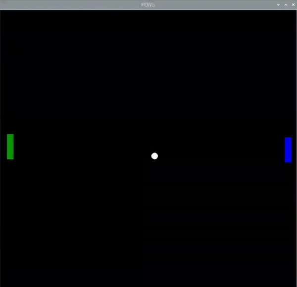

## 패들 충돌

게임이 거의 완료되었지만 먼저 패들을 치는 공을 덮는, 추가 충돌 감지를 추가하셔야 합니다.

--- task ---

`while True` 루프 내에서 공의 `x` 위치가, 패들이 움직이는 수평선에 있는지 확인합니다. 또한 `and` 를 사용하여 공의 `y` 위치가 패들로 덮인 수직 영역 내에 있는지 확인합니다.

--- code ---
---
language: python 
filename: pong.py   
line_numbers: true   
line_number_start: 47
line_highlights: 48
---

paddle_left.sety(pos_left)   
if (ball.xcor() < -180 and ball.xcor() > -190) and (ball.ycor() < paddle_left.ycor() + 20 and ball.ycor() > paddle_left.ycor() - 20): 
    ball.setx(-180)  
    ball.speed_x *= -1

--- /code ---

--- /task ---

프로그램을 실행해 보세요. 당신은 패들에서 공을 튕겨내고 '스쿼시!' 의 솔로 게임을 할 수 있어야 합니다!

이제 공이 화면 밖으로 사라지는 것을 막을 수 있는 방법이 생겼습니다. 이제 세이브에 실패하면 어떻게 되는지 생각할 때입니다.

지금은 공을 시작점으로 리셋해 보도록 하겠습니다.

--- task ---

`while True` loop 내에 다음 코드를 추가하세요:

--- code ---
---
language: python   
filename: pong.py   
line_numbers: true   
line_number_start: 52
line_highlights: 53-56
---

        ball.speed_x *= -1   
    if ball.xcor() < -195: #왼쪽   
        ball.hideturtle()   
        ball.goto(0,0)   
        ball.showturtle()

--- /code ---

--- /task ---

다양한 설정에 만족했다면, 두 번째 패들을 추가할 차례입니다.

왼쪽 패들용으로 만든 것을 시작점으로 사용하여, 게임 영역의 오른쪽에 두 번째 패들을 추가합니다.

--- task ---

먼저 두 번째 LEGO® Technic™ 모터를 Build HAT(포트 B)에 연결하고, 프로그램에서 설정합니다.

--- code ---
---
language: python   
filename: pong.py   
line_numbers: true   
line_number_start: 5
line_highlights: 6
---

motor_left = Motor('A')   
motor_right = Motor('B')

--- /code ---

--- /task ---

--- task ---

왼쪽 패들을 설정하기 위한 코드를 복사하여 붙여넣고 오른쪽 패들의 이름과 값을 변경하면 더 수월하게 코딩할 수 있습니다.

--- /task ---

--- task ---

오른쪽 패들에 대한 코드를 만드십시오.

--- code ---
---
language: python   
filename: pong   
line_numbers: true   
line_number_start: 20
line_highlights: 27-32
---

paddle_left = Turtle()   
paddle_left.color('green')   
paddle_left.shape("square")   
paddle_left.shapesize(4,1,1)   
paddle_left.penup()   
paddle_left.setpos(-190,0)

paddle_right = Turtle()   
paddle_right.color('blue')   
paddle_right.shape("square")   
paddle_right.shapesize(4,1,1)   
paddle_right.penup()   
paddle_right.setpos(190,0)

--- /code ---

--- /task ---

--- task ---

오른쪽 패들 위치에 대한 변수, 패들에 대한 함수, 그리고 오른쪽 모터가 움직일 때 함수를 호출하는 라인을 추가합니다.

--- code ---
---
language: python   
filename: pong.py   
line_numbers: true   
line_number_start: 37
line_highlights: 38, 46-48, 52
---

pos_left = 0   
pos_right = 0

def moved_left(motor_speed, motor_rpos, motor_apos):   
    global pos_left   
    pos_left = motor_apos

def moved_right(motor_speed, motor_rpos, motor_apos):   
    global pos_right   
    pos_right = motor_apos

motor_left.when_rotated = moved_left   
motor_right.when_rotated = moved_right

--- /code ---

--- /task ---

--- task ---

`while True` loop 내에 패들을 업데이트하는 라인을 추가해주세요:

--- code ---
---
language: python   
filename: pong.py   
line_numbers: true   
line_number_start: 64
line_highlights: 65
---

    paddle_left.sety(pos_left)   
    paddle_right.sety(pos_right)

--- /code ---

--- /task ---

현재, 공은 오른쪽 벽에서 튕겨 나갈 것입니다. 공이 오른쪽 벽 대신 중앙으로 리셋되도록 프로그램의 라인을 수정하십시오.

--- task ---

`xcor` 대한 조건을 재설정합니다.

--- code ---
---
language: python   
filename: pong.py   
line_numbers: true   
line_number_start: 60
line_highlights:
---

    if ball.xcor() > 195:   
        ball.hideturtle()   
        ball.goto(0,0)   
        ball.showturtle()

--- /code ---

--- /task ---

--- task ---

이제 충돌을 처리하기 위해 왼쪽 패들과 마찬가지로 오른쪽 패들에도 유사한 조건을 추가하세요.

--- code ---
---
language: python   
filename: pong.py   
line_numbers: true   
line_number_start: 68
line_highlights: 71-73
---

    if (ball.xcor() < -180 and ball.xcor() > -190) and (ball.ycor() < paddle_left.ycor() + 20 and ball.ycor() > paddle_left.ycor() - 20):  
        ball.setx(-180)   
        ball.speed_x *= -1   
    if (ball.xcor() > 180 and ball.xcor() < 190) and (ball.ycor() < paddle_right.ycor() + 20 and ball.ycor() > paddle_right.ycor() - 20):   
        ball.setx(180)   
        ball.speed_x *= -1

--- /code ---

--- /task ---

이제 Pong 게임에는 2명이 참여할 수 있습니다.

--- save ---
