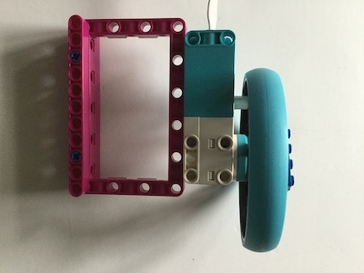

## Improve your project

게임을 마무리하기 위해 추가할 수 있는 몇 가지 부가 기능이 있습니다.

### 점수 추가하기

--- task ---

두 개의 변수(각 플레이어에 대해 하나씩) 를 사용하여 점수를 기록하고 라운드를 질 때마다 업데이트하세요.

--- hints --- --- hint ---

먼저 프로그램 상단에 새 변수를 선언하고 시작 점수를 0으로 설정합니다.

```python   
score_r = 0   
score_l = 0   
```

--- /hint --- --- hint ---

공을 놓칠 때마다 score 변수를 1씩 증가시킵니다. 수정해야 할 두 가지 조건문이 있습니다.


--- /hint ---

--- hint ---

```python
    if ball.xcor() > 195: #Right
        ball.hideturtle()
        ball.goto(0,0)
        ball.showturtle()
        score_r+=1
    if ball.xcor() < -195: #Left
        ball.hideturtle()
        ball.goto(0,0)
        ball.showturtle()
        score_l+=1
```

--- /hint ---

--- /hints --- --- /task ---

이제 게임 영역에 점수를 표시해야 합니다. fourth Turtle을 사용해서 이름을 지을 수 있습니다.

--- task ---

클럽과 공 터틀을 만든 후 `while True` 루프 앞에 다음을 추가하십시오.

```python
writer = Turtle()
writer.hideturtle()
writer.color('grey')
writer.penup()
style = ("Courier",30,'bold')
writer.setposition(0,150)
writer.write(f'{score_l} PONG {score_r}', font=style, align='center')
```

Turtle 라이브러리 문서를 보면 텍스트가 표시되는 방식에 대한 다른 옵션이 무엇인지 확인할 수 있습니다.

--- /task ---

지금 프로그램을 실행하면 점수와 Pong 범례가 나타나야 하지만 점수는 업데이트되지 않습니다.

--- task ---

공이 패들에 의해 놓쳐 왼쪽이나 오른쪽으로 사라지는 경우와 같은 각 득점 상황에 대한 두 가지 조건을 찾고 새로운 값을 다시 작성하여 점수를 업데이트합니다.

```python
     writer.clear()
     writer.write(f'{score_l} PONG {score_r}', font=style, align='center')
```

--- /task ---


### 타이머 추가하기

몇 가지 간단한 음향 효과가 나오도록 하려면 버저를 Raspberry Pi의 GPIO 핀에 연결합니다.

[[[rpi-connect-buzzer]]]

브레드보드를 사용하는 대신 양쪽 끝에 암 소켓이 있는 점퍼 리드를 사용하고 버저 다리를 소켓에 넣을 수 있습니다. 그런 다음 몇 가지 LEGO® element를 사용하여 부저를 장착하여 게임 세션 중에 부저가 흔들리거나 연결이 끊어지지 않도록 합니다.


--- task ---

이제 프로그램 시작 시 가져오기 목록에 `gpiozero` 라이브러리를 추가합니다.

```python
from gpiozero import Buzzer
```

그런 다음 플러스(+) 다리를 연결한 핀을 설정하여 프로그램에서 부저를 사용할 수 있도록 합니다. 이 예시에서는 핀 17을 사용했습니다.

```python
buzz = Buzzer(17)
```

핀 17을 사용하지 않은 경우 부저가 연결된 핀을 반영하도록 값을 변경하세요.

--- /task ---

이제 패들과 공이 접촉할 때마다 게임이 짧은 톤으로 재생되도록 하세요.

--- task ---

볼과 패들에 대한 조건을 `if`문에 다음과 같이 추가하세요.

```python
buzz.beep(0.1,0.1,background=True)
```

그런 다음 플레이어가 공을 놓칠 때마다 더 긴 톤을 재생하도록 라인을 추가하도록 합니다.

```python
buzz.beep(0.5,0.5,background=True)
```

--- /task ---

[GPIO Zero 문서](https://gpiozero.readthedocs.io/en/stable/api_output.html#buzzer)에서 버저와 함께 사용할 수 있는 다른 옵션에 대해 자세히 알아볼 수 있습니다.

### 컨트롤러 사용자 정의하기

Python Turtle 프로그램에서는, 패들에 다른 색상을 사용했습니다. 같은 색상의 브릭과 기타 LEGO® 요소를 추가하여 LEGO® 컨트롤러를 사용자 정의할 수 있습니다.


모터를 더 편안하게 잡을 수 있도록 손잡이를 새롭게 디자인할 수도 있습니다.




이제 게임을 플레이할 수 있습니다. 다음에 할 수 있는 다른 프로젝트를 해 보기 전에 재미있게 즐기세요.

--- save ---
