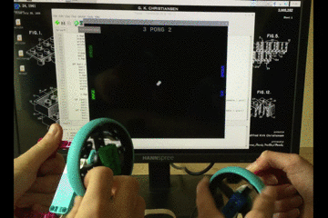

## Введение

В этом проекте ты будешь использовать Raspberry Pi Build HAT, двигатель энкодер и колесо LEGO® Technic™, а также библиотеку Черепашку из Python, чтобы создать простой игровой контроллер, который можно использовать для игры в Понг.

[Понг](https://ru.wikipedia.org/wiki/Pong_(%D0%B8%D0%B3%D1%80%D0%B0)) - одна из самых ранних аркадных видеоигр, первоначально выпущенная в 1972 году компанией Atari. Это игра в настольный теннис с простой двухмерной графикой. Игроки управляют ракетками на каждой стороне экрана, с помощью которых они отбивают мяч то в одну сторону, то в другую.

Ты:
- Узнаешь, как считывать градусы вращения двигателей LEGO® Technic™
- Научишься рисовать и перемещать изображения Черепашки с помощью двигателей LEGO® Technic™
- Научишься обнаруживать коллизии между объектами, используя координаты `x` и `y`

--- no-print ---

--- /no-print ---

--- print-only ---

--- /print-only ---

### Тебе понадобится

+ Компьютер Raspberry Pi
+ Raspberry Pi Build HAT
+ Как минимум один мотор LEGO® Technic™
+ Детали LEGO®, включая колеса (мы использовали детали из [набора LEGO® Education SPIKE™ Prime](https://education.lego.com/en-gb/product/spike-prime))
+ Небольшая макетная плата (необязательно)
+ Зуммер (необязательно)
+ Несколько соединительных проводов для макетной платы (необязательно)
+ Блок питания 7,5 В с цилиндрическим гнездом (необязательно). Ты можешь использовать официальный источник питания Raspberry Pi для этого проекта, так как двигатели энкодеры не будут потреблять питание

### Программное обеспечение

+ Python 3
+ Библиотека Python Build HAT

--- collapse ---
---
title: Дополнительная информация для преподавателей
---

Ты можешь скачать завершенный проект [здесь](https://rpf.io/p/en/lego-game-controller-get){:target="_blank"}.

Если ты хочешь распечатать этот проект, то воспользуйся [версией для печати](https://projects.raspberrypi.org/en/projects/lego-game-controller/print){:target="_blank"}.

--- /collapse ---

Прежде чем ты начнешь, тебе необходимо настроить твой компьютер Raspberry Pi и подключить свою плату Build HAT:

--- task ---

Mount your Raspberry Pi on to the LEGO Maker Plate using M2 bolts and nuts, making sure the Raspberry Pi is on the side without the 'edge':

 

--- /task ---

Установка Raspberry Pi таким образом обеспечивает легкий доступ к портам, а также к слоту для SD-карты. The Maker Plate will allow you to connect the Raspberry Pi to the main structure of your dashboard more easily.

--- task ---

Совмести плату Build HAT с Raspberry Pi, убедившись, что ты видишь надпись на английском `This way up`. Убедись, что все контакты GPIO закрыты платой HAT, и с усилием надави на плату. (В примере используется [проводные клеммы](https://www.adafruit.com/product/2223){:target="_blank"}, которые делают выводы длиннее)

 

--- /task ---

Теперь ты должен подать питание на Raspberry Pi с помощью цилиндрического разъема 7,5 В на плате Build HAT, что позволит тебе использовать двигатели.

--- task ---

Если ты еще этого не сделал, настрой Raspberry Pi, следуя этим инструкциям:

[Настройка твоей Raspberry Pi](https://projects.raspberrypi.org/en/projects/raspberry-pi-setting-up){:target="_blank"}

--- /task ---

--- task ---

После загрузки Raspberry Pi открой Инструмент Настройки Raspberry Pi, нажав кнопку Меню Raspberry и выбрав «Настройки», а затем «Конфигурация Raspberry Pi».

Выбери вкладку «Интерфейсы» и настрой параметры последовательного порта, как показано ниже:

--- /task ---

--- task ---

Тебе также понадобится установить библиотеку Python buildhat, следуя этим инструкциям:

--- collapse ---
---
title: Установка библиотеки Python buildhat
---

Откройте окно терминала на Raspberry Pi, нажав <kbd>Ctrl</kbd>+<kbd>Alt</kbd>+<kbd>T</kbd>.

В командной строке введи: `sudo pip3 install buildhat`

Нажми <kbd>Ввод</kbd> и дождись сообщения «установка завершена» (или «installation completed» на английском).

--- /collapse ---

--- /task ---
