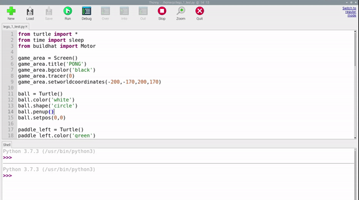

## Перемещаем мяч

Мяч будет отскакивать от экрана, поэтому необходимы две переменные, чтобы отслеживать его скорость в направлениях `x` и `y`. Эти числа могут быть больше, чтобы усложнить игру, или меньше, чтобы ее упростить.

--- task ---

Добавь следующий код в свою программу:

--- code ---
---
language: python   
filename: pong.py   
line_numbers: true   
line_number_start: 23
line_highlights:
---

ball.speed_x = 1   
ball.speed_y = 1

--- /code ---

--- /task ---

Ты можешь проверить, где находится Черепашка, используя `turtle.xcor()` и `turtle.ycor()` чтобы найти `x` и `y` координаты соответственно.

Итак, чтобы мяч двигался, ты можешь комбинировать положение и скорость.

--- task ---

Добавь эти строку ниже в свою программу:

--- code ---
---
language: python   
filename: pong.py   
line_numbers: true   
line_number_start: 27
line_highlights: 30, 31
---

while True:   
game_area.update()   
ball.setx(ball.xcor() + ball.speed_x)   
ball.sety(ball.ycor() + ball.speed_y)

--- /code ---

--- /task ---

Запусти программу и посмотрите, что получится!

Мяч должен двигаться по диагонали вверх по направлению к правому верхнему углу игровой зоны... и дальше за экран! Если ты хочешь, чтобы твоя игра была быстрой и сложной, ты можешь увеличить значения `speed_x` и `speed_y`, чтобы мяч двигался быстрее.

Мяч должен отскочить от верхней стены, а не исчезнуть с экрана. Для этого можно изменить скорость, заставив мяч двигаться в противоположном направлении, если его положение `y` больше 160.

--- task ---

Добавь следующий код в игровой цикл и запустите его.

--- code ---
---
language: python   
filename: pong.py     
line_numbers: true   
line_number_start: 27
line_highlights: 32, 33
---

while True:   
game_area.update()   
ball.setx(ball.xcor() + ball.speed_x)   
ball.sety(ball.ycor() + ball.speed_y)   
if ball.ycor() > 160: ball.speed_y *= -1

--- /code ---

--- /task ---

--- task ---

Запусти свой код еще раз, и мяч должен отскочить от верхней части экрана, но исчезнуть в правой части экрана.

--- /task ---

Таким же образом, как код проверяет верхнюю позицию `y`, чтобы заставить его отскочить, он может проверить правую `x` и нижнюю `y` позиции в твоём игровом цикле.

--- task ---

Добавьте эти проверки для позиции мяча.

--- code ---
---
language: python   
filename: pong.py   
line_numbers: true   
line_number_start: 32
line_highlights:
---

    if ball.ycor() > 160:   
        ball.speed_y *= -1   
    if ball.xcor() > 195:   
        ball.speed_x *= -1   
    if ball.ycor() < -160:   
        ball.speed_y *= -1

--- /code ---

--- /task ---

Теперь мяч должен отскочить от экрана и отлететь от левого края. Затем ты будешь управлять ракеткой, чтобы мяч отражался от левого края.

--- save ---
