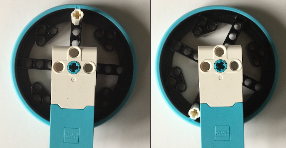

## Управляем ракеткой

### Разработка элементов управления

Мотор LEGO® Spike™ будет использоваться для управления положением ракетки, но нам нужно будет запретить делать полные обороты мотора.

Простой способ ограничить движение колеса - добавить элемент LEGO®, чтобы колесо не поворачивалось до конца.

--- task ---

Совмести метки энкодера на твоём моторе с помощью колеса, как и раньше. Вставь колышек или ось как можно ближе к меткам.

--- /task ---

--- print-only ---

--- /print-only ---

--- task ---

Add a line to create the `motor_left` object after the import line.

--- code ---
---
language: python   
filename: pong.py   
line_numbers: true   
line_number_start: 3
line_highlights: 5
---

from buildhat import Motor

motor_left = Motor('A')

--- /code ---

--- /task ---

Теперь нужна новая переменная, чтобы отслеживать местоположение ракетки. Она будет называться `pos_left` и установим её в `0`.

--- code ---
---
language: python   
filename: pong.py   
line_numbers: true   
line_number_start: 26
line_highlights: 29
---

ball.speed_x = 0.4   
ball.speed_y = 0.4

pos_left = 0

--- /code ---

--- task ---

Создай функцию для ракетки, которая будет работать при перемещении энкодера двигателя. Обрати внимание, что он использует `глобальную` переменную и так им образом он может изменять значение переменной `pos_left`.

--- code ---
---
language: python   
filename: pong.py   
line_numbers: true   
line_number_start: 31
line_highlights:
---

def moved_left(motor_speed, motor_rpos, motor_apos):   
global pos_left   
pos_left = motor_apos

--- /code ---

--- /task---

--- task ---

Теперь добавь одну строку, которая будет использовать эту функцию при каждом перемещении двигателя. Это может быть непосредственно перед твоим циклом `while`.

--- code ---
---
language: python   
filename: pong.py   
line_numbers: true   
line_number_start: 35
line_highlights:
---

motor_left.when_rotated = moved_left

--- /code ---

--- /task ---

--- task ---

Затем добавь строку в цикл `while True`, чтобы переместить объект ракетки на экране в новую позицию.

--- code ---
---
language: python   
filename: pong.py   
line_numbers: true   
line_number_start: 45
line_highlights: 47
---

    if ball.ycor() < -160:   
        ball.speed_y *= -1   
    paddle_left.sety(pos_left)

--- /code ---

--- /task ---

--- task ---

Запусти свой код, а затем поверни колесо на энкодере двигателя. Ты должен увидеть, как твоя ракетка движется вверх и вниз по экрану.

--- /task ---

Если есть неразрешимые ошибки, твой код должен выглядеть так:

--- code ---
---
language: python   
filename: pong.py   
line_numbers: true   
line_number_start:
line_highlights:
---

from turtle import *   
from time import sleep   
from buildhat import Motor

motor_left = Motor('A')

game_area = Screen()   
game_area.title('ПОНГ')   
game_area.bgcolor('black')   
game_area.tracer(0)   
game_area.setworldcoordinates(-200,-170,200,170)

ball = Turtle()   
ball.color('white')   
ball.shape('circle')   
ball.penup()   
ball.setpos(0,0)

paddle_left = Turtle()   
paddle_left.color('green')   
paddle_left.shape("square")   
paddle_left.shapesize(4,1,1)   
paddle_left.penup()   
paddle_left.setpos(-190,0)

ball.speed_x = 0.4   
ball.speed_y = 0.4

pos_left = 0

def moved_left(motor_speed, motor_rpos, motor_apos):   
global pos_left   
pos_left = motor_apos

motor_left.when_rotated = moved_left

while True:   
game_area.update()   
ball.setx(ball.xcor() + ball.speed_x)   
ball.sety(ball.ycor() + ball.speed_y)   
if ball.ycor() > 160: ball.speed_y *= -1   
if ball.xcor() > 195: ball.speed_x *= -1   
if ball.ycor() < -160:   
ball.speed_y *= -1   
paddle_left.sety(pos_left)

--- /code ---

--- save ---