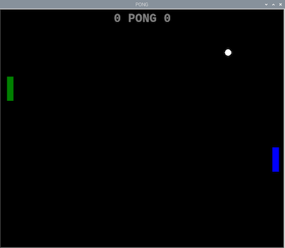

## Finishing touches

There are few additional features you can add to finish off your game.

### Adding a score

--- task ---

Keep track of the score by using two variables (one for each player) and update them whenever a round is lost.

--- hints --- --- hint ---

First of all, declare the new variables somewhere towards the top of the program and set the starting score to zero.

```python   
score_r = 0   
score_l = 0   
```

--- /hint --- --- hint ---

Whenever a ball is missed, increment the appropriate score variable by one. There are two conditional tests you'll need to modify.


--- /hint ---

--- hint ---

```python
    if ball.xcor() > 195: #Right
        ball.hideturtle()
        ball.goto(0,0)
        ball.showturtle()
        score_r+=1
    if ball.xcor() < -195: #Left
        ball.hideturtle()
        ball.goto(0,0)
        ball.showturtle()
        score_l+=1
```

--- /hint ---

--- /hints --- --- /task ---

Now you need to display the score on the game area. You can use a fourth Turtle to do this.

--- task ---

Add the following to your program after the creation of the paddle and ball Turtles, but before the `while True` loop.

```python
writer = Turtle()
writer.hideturtle()
writer.color('grey')
writer.penup()
style = ("Courier",30,'bold')
writer.setposition(0,150)
writer.write(f'{score_1} PONG {score_r}', font=style, align='center')
```

You can look at the documentation for the Turtle library to see what other options there are for how the text is displayed.

--- /task ---

If you run your program now, the score and Pong legend should appear, but the scores themsleves won't get updated.

--- task ---

Find the two conditionals for each of the scoring situations — when ball is missed by a paddle and disappears to the left or right — and update the score by re-writing the new value.

```python
     writer.clear()
     writer.write(f'{score_1} PONG {score_r}', font=style, align='center')
```

--- /task ---

You can look at the documentation for the Turtle library to see what other options there are for how the text is displayed.



### Adding a buzzer

To include some simple sound effects, connect a buzzer to the GPIO pins on the Raspberry Pi.

[[[rpi-connect-buzzer]]]


Instead of using a breadboard, you could use jumper leads with female sockets at both ends and poke the legs of the buzzer into the socket. Then use some LEGO® elements to mount the buzzer so that it doesn't flop around and become disconnected during frantic gaming sessions.


--- task ---

Now add the `gpiozero` library to the list of imports at the start of you program:

```python
from gpiozero import Buzzer
```

Then, make the buzzer available for the program to use by setting which pin you have connected the positive (+) leg to. In this example, we used Pin 17.

```python
buzz = Buzzer(17)
```
If you didn't use Pin 17, change the value to reflect the pin your buzzer is connected to.


--- /task ---

Now, whenever the paddle and ball make contact, you want the game to play a short tone.

--- task ---

Add this line to each action part of the collision detection `if` conditionals for the ball and paddle:

```python
buzz.beep(0.1,0.1,background=True)
```

Then add a  line to play a longer tone whenever the player misses the ball

```python
buzz.beep(0.5,0.5,background=True)
```

--- /task ---


You can read more about the options available with buzzers in the [GPIO Zero documentation](https://gpiozero.readthedocs.io/en/stable/api_output.html#buzzer).


### Customising your controllers

In your Python Turtle program, you have used different colours for the paddles. You can customise your LEGO® controllers by adding bricks and other LEGO® elements of the same colour.


You could also design a handle for the motor to make it more comfortable to hold.


### Adding some randomness

At the moment, the motion of the ball will always start exactly the same way each time. Add some randomness to make the game more interesting.

--- task ---

First of all, add the random library to the imports section at the start of the program.

```python
import random
```

Then find the line where you set the ball's initial position and speed so that the `x` and `y` components of the motion both incorporate an initial random offset. This is then multiplied either by 1 or -1 (chosen at random) so that the ball's initial trajectory can be anywhere in the game area and not just diagonally towards the top right corner. Set this as a function so you can call it whenever you need to restart the game without duplicating all these lines.

```python
def ball_start(start_value):
    ball.setpos(0,0)
    ball.speed(0)
    ball.dx = start_value * random.uniform(0.8,1.5) * random.choice([-1,1])
    ball.dy = start_value * random.uniform(0.8,1.5) * random.choice([-1,1])
```

To tweak the feel of the game, you can modify the range of values that the first random numbers take.

--- /task ---

--- task ---

Now add a call to this function at the start of the game (just before the `while True` loop and at both points where the ball is reset to the centre after a miss.

```python

ball_start(0.7)
```
--- /task ---

Your game should now be playable. Have some fun with it before seeing what else you can do next.

--- save ---
