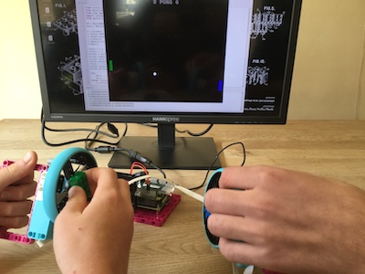

## 介绍

在本项目中，您将使用 Raspberry Pi Build HAT、乐高（LEGO®）Technic™ 编码马达，车轮以及 Python Turtle 库来制作可用于玩 Pong 的简单游戏控制器。

[Pong](https://zh.wikipedia.org/wiki/%E4%B9%93) 是最早的街机视频游戏之一，最初由 Atari 于 1972 年发布。 这是一款简单的二维图形乒乓球游戏。 两侧的玩家通过控制屏幕上的球拍将球击回对方。

您将要：
- 学习如何读取乐高（LEGO®）Technic™ 马达的旋转度数
- 学习如何通过乐高（LEGO®）Technic™ 马达来绘制和移动（Python）Turtle图形
- 学习如何通过`x` 和 `y` 坐标来检测图形之间的碰撞

--- no-print ---

--- /no-print ---

--- print-only ---

--- /print-only ---

### 您将需要：

+ 一台树莓派电脑(Raspberry Pi)
+ 一个Raspberry Pi Build HAT
+ 至少一个乐高（LEGO® ）Technic™马达
+ 各种乐高（LEGO®）组件，包括车轮（我们从 [LEGO® Education SPIKE™ Prime 套件](https://education.lego.com/en-gb/product/spike-prime)中选择了一些）
+ 一块小面包板（可选）
+ 一个蜂鸣器（可选）
+ 一些面包板用的跳线（可选）
+ 一个带桶形插孔的 7.5V 电源（可选）。 编码马达并不需要电源，因此在本项目中您可以仅使用官方 Raspberry Pi 电源。

### 软件

+ Python 3
+ Build HAT Python 库

--- collapse ---
---
title: 为教师提供的额外信息
---

您可以在 [此处](https://rpf.io/p/en/lego-game-controller-get){:target="_blank"}下载已完成的项目。

如果您需要打印本项目的文件，请使用[适合打印版本](https://projects.raspberrypi.org/en/projects/lego-game-controller/print){:target="_blank"}。

--- /collapse ---

在开始之前，您需要设置好您的 Raspberry Pi 并连接您的 Build HAT：

--- task ---

使用 M2 螺栓和螺母将您的 Raspberry Pi 安装到乐高（LEGO®）Maker Plate上，请确保 将Raspberry Pi 置于没有“边缘”的一侧：

 

--- /task ---

以这种方式安装 Raspberry Pi 可以轻松访问（Raspberry Pi的）端口和 SD 卡插槽。 Maker Plate 可让您更轻松地将 Raspberry Pi 连接到仪表板的主要部件。

--- task ---

将 Build HAT 与 Raspberry Pi 对齐，请确保您可以看到 `This way up` 标签。 确保Build HAT准确滴覆盖了所有的 GPIO 引脚，然后用力按下。 （该示例使用了 [堆叠头](https://www.adafruit.com/product/2223){:target="_blank"}，所以有更长的引脚。）

 

--- /task ---

现在利用 Build HAT 上的 7.5V 桶形插孔为您的 Raspberry Pi 供电，这也将用于驱动马达。

--- task ---

如果您尚未设置您的 Raspberry Pi，请按照以下步骤：

[设置你的Raspberry Pi](https://projects.raspberrypi.org/en/projects/raspberry-pi-setting-up){:target="_blank"}

--- /task ---

--- task ---

Raspberry Pi 启动后，单击 Raspberry 菜单按钮，然后选择“首选项”，然后选择“Raspberry Pi 配置”，打开 Raspberry Pi 配置工具。

单击“interfaces”选项卡并调整串口设置，如下所示：

--- /task ---

--- task ---

您还需要按照以下说明安装 buildhat的 python 库：

--- collapse ---
---
title：安装 buildhat Python 库
---

按下<kbd>Ctrl</kbd>+<kbd>Alt</kbd>+<kbd>T</kbd>，在 Raspberry Pi 上打开一个终端窗口。

在提示符后键入： `sudo pip3 install buildhat`

按 <kbd>回车</kbd> 并等待“installation completed”消息。

--- /collapse ---

--- /task ---
