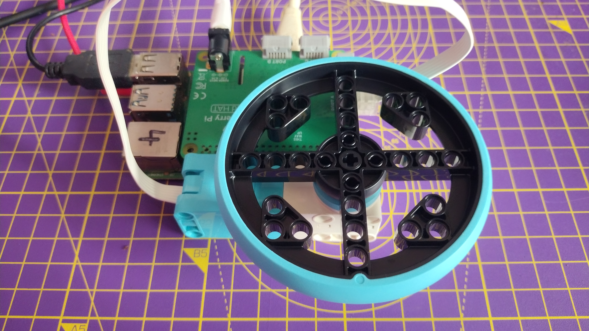

## 使用乐高（LEGO®）Spike™ 编码马达

编码马达不仅可以旋转，还可以准确检测自己旋转了多少度。


乐高（LEGO®）Spike™ 马达都有编码器。 如果你查看马达的旋转盘，会看到一个形状像棒棒糖的标记。该标记可以与马达白色机身上的0标记对齐。 此时马达编码设置为零度，马达的电机轴的任何角运动都可以相对于该点进行测量。

--- collapse ---
---
title：编码马达的工作原理
---

编码马达，也称为旋转或轴编码器，是一种机电设备，可让您记录电机轴的角位置或运动。 通常它通过将角位置转换为模拟或数字输出来实现这一点。

如果马达带有编码器，意味着您可以非常准确地设置电机轴的位置。 带有编码器的马达还可以用作输入设备，在轴的位置发生变化时，可以被注册并用于触发计算机程序中的其他操作。

--- /collapse ---

--- task ---

将显示器、键盘和鼠标连接到您的 Raspberry Pi。

将Build HAT 连接到您的 Raspberry Pi，注意要确保徽标朝上，并正确覆盖了所有的引脚。

最后，通过 Build HAT 的桶形插孔或 Raspberry Pi 上的 USB-C 端口接通电源。

--- /task ---

--- task ---

将马达连接到 Build HAT 上的端口 A。


--- /task ---

--- task ---

使用四个连接销将一个大轮子连接到马达上。 转动轮子，使棒棒糖标记与零对齐。

 

--- /task ---

--- task ---

从 Raspberry Pi的 **Programming** 菜单中打开 Thonny，然后单击窗口底部的 **Shell**

--- /task ---

--- task ---

首先，导入 Build HAT 库。

```python
from buildhat import Motor
```
按回车。

--- /task ---

--- task ---

然后，创建一个马达对象，并告诉 Python 马达已连接到端口 `A`。 输入：

```python
motor_left = Motor('A')
```
按回车 （此时会有轻微延迟，请耐心等待！）

--- /task ---

--- task ---

现在，您就可以要求马达报告电机轴的 **绝对** 位置。 这将始终介于 `-180` 和 `180`之间。

```python
motor_left.get_aposition()
```

根据您开始时对马达电机轴的定位程度，您应该得到一个接近 `0`的值。

移动马达电机轴并再次键入上一行指令，观察输出值的变化。

--- /task ---

--- task ---

您也可以跟踪马达电机轴的 **相对** 位置。 这将记录马达从程序开始至今一共移动了多远，所以轮子每转动一圈，计数都会增加或者减少 `360`

```python
motor_left.get_position()
```
--- /task ---

--- task ---

移动马达电机轴并（运行上述指令）检查电机轴的绝对和相对位置，以便您了解读数是如何变化的。

--- /task ---


