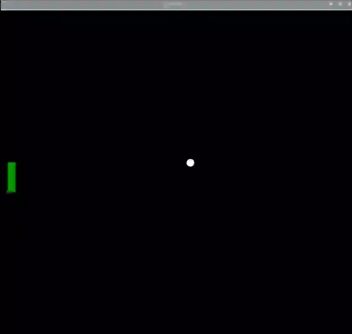

## 控制球拍

### 设计控制器

乐高（LEGO®）Spike™ 马达将被用于控制划桨的位置，但您希望能控制它不要全轴转动。

限制车轮运动的一种简单方法是通过添加一个乐高（LEGO®）组件来防止车轮转动一整圈。

--- task ---

像以前一样，将轮子和马达上的编码标记对齐。 在尽可能接近标记的水平位置插入一个钉子或轴。

--- /task ---

--- print-only ---

--- /print-only ---

--- task ---

在导入行之后添加一行以创建 `motor_left`。

--- code ---
---
language: python   
filename: pong.py   
line_numbers: true   
line_number_start: 3
line_highlights: 5
---

from buildhat import Motor

motor_left = Motor('A')

--- /code ---

--- /task ---

现在需要一个新的变量来跟踪球拍的位置。 将变量命名为 `pos_left` 并初始化为 `0`。

--- code ---
---
language: python   
filename: pong.py   
line_numbers: true   
line_number_start: 26
line_highlights: 29
---

ball.speed_x = 0.4   
ball.speed_y = 0.4

pos_left = 0

--- /code ---

--- task ---

为球拍创建一个函数并在编码马达移动时运行。 注意它使用了 `全局` 变量，以便更改 `pos_left` 变量的值。

--- code ---
---
language: python   
filename: pong.py   
line_numbers: true   
line_number_start: 31
line_highlights:
---

def moved_left(motor_speed, motor_rpos, motor_apos):   
    global pos_left   
    pos_left = motor_apos

--- /code ---

--- /task ---

--- task ---

现在添加一行代码，使得每次马达移动时都将触发该函数。 它可以放在您的 `while` 循环之前。

--- code ---
---
language: python   
filename: pong.py   
line_numbers: true   
line_number_start: 35
line_highlights:
---

motor_left.when_rotated = moved_left

--- /code ---

--- /task ---

--- task ---

然后在`while True` 循环中添加一行，及时更新球拍在屏幕上位置。

--- code ---
---
language: python   
filename: pong.py   
line_numbers: true   
line_number_start: 45
line_highlights: 47
---

    if ball.ycor() < -160:   
        ball.speed_y *= -1   
    paddle_left.sety(pos_left)

--- /code ---

--- /task ---

--- task ---

运行您的代码，然后转动连接到编码马达上的轮子。 您应该会看到屏幕上的球拍在上下移动。

--- /task ---

如果出现错误，您当前的代码应该类似这样：

--- code ---
---
language: python   
filename: pong.py   
line_numbers: true   
line_number_start:
line_highlights:
---

from turtle import *   
from time import sleep   
from buildhat import Motor

motor_left = Motor('A')

game_area = Screen()   
game_area.title('PONG')   
game_area.bgcolor('black')   
game_area.tracer(0)   
game_area.setworldcoordinates(-200,-170,200,170)

ball = Turtle()   
ball.color('white')   
ball.shape('circle')   
ball.penup()   
ball.setpos(0,0)

paddle_left = Turtle()   
paddle_left.color('green')   
paddle_left.shape("square")   
paddle_left.shapesize(4,1,1)   
paddle_left.penup()   
paddle_left.setpos(-190,0)

ball.speed_x = 0.4   
ball.speed_y = 0.4

pos_left = 0

def moved_left(motor_speed, motor_rpos, motor_apos):   
    global pos_left   
    pos_left = motor_apos

motor_left.when_rotated = moved_left

while True:   
    game_area.update()   
    ball.setx(ball.xcor() + ball.speed_x)   
    ball.sety(ball.ycor() + ball.speed_y)   
    if ball.ycor() > 160: 
        ball.speed_y *= -1   
    if ball.xcor() > 195: 
        ball.speed_x *= -1   
    if ball.ycor() < -160:   
        ball.speed_y *= -1   
    paddle_left.sety(pos_left)

--- /code ---

--- save ---