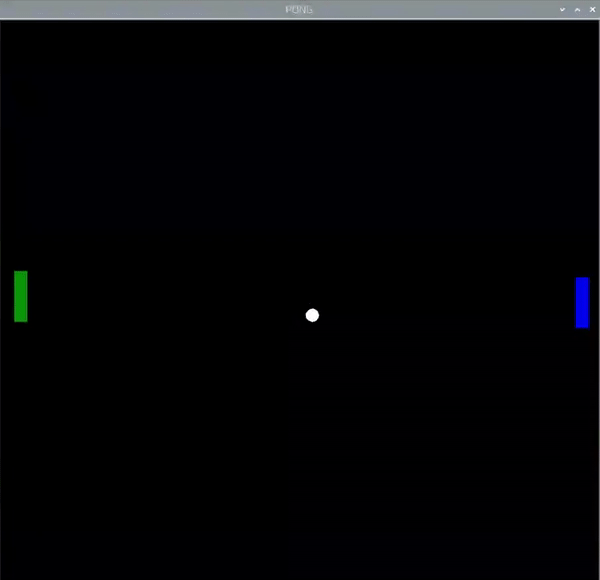

## 撞击球拍

Pong游戏几乎做好了——但首先您需要添加一些额外的撞击检测来发现球击中球拍的情景。

--- task ---

在 `while True` 循环内，检测球的 `x` 位置是否在球拍覆盖的水平区域内。 同时使用 `and` 来检测球的 `y` 位置是否在球拍移动的垂直线上

--- code ---
---
language: python filename: pong.py   
line_numbers: true   
line_number_start: 47
line_highlights: 48
---

paddle_left.sety(pos_left)   
if (ball.xcor() < -180 and ball.xcor() > -190) and (ball.ycor() < paddle_left.ycor() + 20 and ball.ycor() > paddle_left.ycor() - 20): 
    ball.setx(-180)  
    ball.speed_x *= -1

--- /code ---

--- /task ---

试试这个程序。 您应该能够将球从您的球拍上弹回，开启单人”壁球”的游戏！

现在您有办法补救并防止球消失在屏幕内，是时候考虑如果您未能及时补救会发生什么。

现在，让我们将球重置到起点。

--- task ---

在`while True` 循环中添加此代码：

--- code ---
---
language: python   
filename: pong.py   
line_numbers: true   
line_number_start: 52
line_highlights: 53-56
---

        ball.speed_x *= -1   
    if ball.xcor() < -195: #Left   
        ball.hideturtle()   
        ball.goto(0,0)   
        ball.showturtle()

--- /code ---

--- /task ---

在您对各种设置都感到满意时，就可以添加第二个球拍了。

仿照您为左侧球拍创建的内容，在游戏区域的右侧添加第二个球拍。

--- task ---

首先，将第二个乐高（LEGO®）Technic™ 马达连接到 Build HAT（端口 B）并在程序中进行设置。

--- code ---
---
language: python   
filename: pong.py   
line_numbers: true   
line_number_start: 5
line_highlights: 6
---

motor_left = Motor('A')   
motor_right = Motor('B')

--- /code ---

--- /task ---

--- task ---

您可以复制并粘贴设置左侧球拍的代码，更改为右侧球拍的名称和值。

--- /task ---

--- task ---

创建你的右侧球拍。

--- code ---
---
language: python   
filename: pong   
line_numbers: true   
line_number_start: 20
line_highlights: 27-32
---

paddle_left = Turtle()   
paddle_left.color('green')   
paddle_left.shape("square")   
paddle_left.shapesize(4,1,1)   
paddle_left.penup()   
paddle_left.setpos(-190,0)

paddle_right = Turtle()   
paddle_right.color('blue')   
paddle_right.shape("square")   
paddle_right.shapesize(4,1,1)   
paddle_right.penup()   
paddle_right.setpos(190,0)

--- /code ---

--- /task ---

--- task ---

为右侧球拍添加一个函数，一个代表位置的变量，以及在右侧马达移动时调用该函数的代码。

--- code ---
---
language: python   
filename: pong.py   
line_numbers: true   
line_number_start: 37
line_highlights: 38, 46-48, 52
---

pos_left = 0   
pos_right = 0

def moved_left(motor_speed, motor_rpos, motor_apos):   
    global pos_left   
    pos_left = motor_apos

def moved_right(motor_speed, motor_rpos, motor_apos):   
    global pos_right   
    pos_right = motor_apos

motor_left.when_rotated = moved_left   
motor_right.when_rotated = moved_right

--- /code ---

--- /task ---

--- task ---

在 `while True` 循环内添加一行代码以更新右侧球拍在屏幕上位置：

--- code ---
---
language: python   
filename: pong.py   
line_numbers: true   
line_number_start: 64
line_highlights: 65
---

    paddle_left.sety(pos_left)   
    paddle_right.sety(pos_right)

--- /code ---

--- /task ---

目前，球会从右侧的墙上反弹。 修改程序的相关行，使得球不是反弹，而是复位并回到中心点。

--- task ---

更改球在 `xcor` 的条件反应，重置球的位置。

--- code ---
---
language: python   
filename: pong.py   
line_numbers: true   
line_number_start: 60
line_highlights:
---

    if ball.xcor() > 195:   
        ball.hideturtle()   
        ball.goto(0,0)   
        ball.showturtle()

--- /code ---

--- /task ---

--- task ---

现在依照左侧球拍的设置，为右侧球拍添加一个撞击处理情景。

--- code ---
---
language: python   
filename: pong.py   
line_numbers: true   
line_number_start: 68
line_highlights: 71-73
---

    if (ball.xcor() < -180 and ball.xcor() > -190) and (ball.ycor() < paddle_left.ycor() + 20 and ball.ycor() > paddle_left.ycor() - 20):   
        ball.setx(-180)   
        ball.speed_x *= -1   
    if (ball.xcor() > 180 and ball.xcor() < 190) and (ball.ycor() < paddle_right.ycor() + 20 and ball.ycor() > paddle_right.ycor() - 20):   
        ball.setx(180)   
        ball.speed_x *= -1

--- /code ---

--- /task ---

您现在应该有一个简单的双人乒乓球Pong游戏了。

--- save ---
