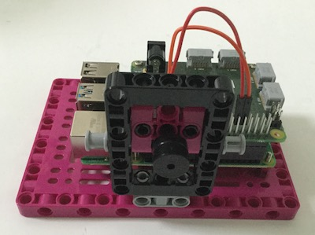
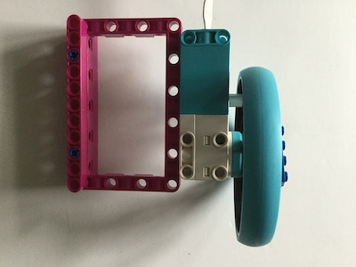

## 改进您的项目

您可以添加一些额外的功能来完成您的游戏。

### 计分

--- task ---

利用两个变量（每个玩家一个）来跟踪分数，并在其中一方输掉一轮时更新它们。

--- hints ---
--- hint ---

首先，在程序顶部的声明用于计分的新变量，并初始化为零。

```python   
score_r = 0   
score_l = 0   
```

--- /hint ---
--- hint ---

每当一方失球时，将对方的得分变量加一。 您需要修改两个条件测试的代码。


--- /hint ---

--- hint ---

```python
        if ball.xcor() > 195: #右侧
        ball.hideturtle()
        ball.goto(0,0)
        ball.showturtle()
        score_r+=1
    if ball.xcor() < -195: #左侧
        ball.hideturtle()
        ball.goto(0,0)
        ball.showturtle()
        score_l+=1
```

--- /hint ---

--- /hints ---
--- /task ---

现在您需要在游戏区域显示分数。 您可以使用第4个Turtle来完成这个任务。

--- task ---

将下面的代码添加到球拍和球的Turtles之后，但是放在您的`while True` 循环之前。

```python
writer = Turtle()
writer.hideturtle()
writer.color('grey')
writer.penup()
style = ("Courier",30,'bold')
writer.setposition(0,150)
writer.write(f'{score_l} PONG {score_r}', font=style, align='center')
```

您可以查看 Turtle 库的文档，以了解有关文本显示的其他选项。

--- /task ---

如果您现在运行您的程序，应该会看到分数和 Pong 的界面，但分数不会实时更新。

--- task ---

找到得分的两个条件 - 当球没有被球拍拦下并向左或向右消失时 - 用新的得分更新计分的变量。

```python
     writer.clear()
     writer.write(f'{score_l} PONG {score_r}', font=style, align='center')
```

--- /task ---


### 添加蜂鸣器

为了添加一些简单的音效，请将蜂鸣器连接到 Raspberry Pi 上的 GPIO 引脚。

[[[rpi-connect-buzzer]]]

您可以不使用面包板，而是使用两端都是母插座的跳线，并将蜂鸣器的腿插入插座。 然后使用一些乐高（LEGO®）组件来固定蜂鸣器，这样它就不会在疯狂的游戏过程中翻来覆去乃至断开连接。



--- task ---

现在将 `gpiozero` 库添加到程序开始时的导入列表中：

```python
from gpiozero import Buzzer
```

然后，依据蜂鸣器正极 (+) 连接的引脚号配置程序，以便使用。 在这个例子中，我们使用了引脚17。

```python
buzz = Buzzer(17)
```

如果您没有使用引脚 17，请依据您的蜂鸣器连接到的引脚号更改这个值。

--- /task ---

现在，您希望每当球拍和球接触时，游戏都能播放短音。

--- task ---

将此行添加到碰撞检测 `if`条件的执行部分

```python
buzz.beep(0.1,0.1,background=True)
```

然后添加一行代码使得在玩家失球时播放一段更长的音调

```python
buzz.beep(0.5,0.5,background=True)
```

--- /task ---

您可以在[GPIO Zero 文档](https://gpiozero.readthedocs.io/zh-CN/stable/api_output.html#buzzer)中阅读更多有关蜂鸣器可用选项的信息。

### 定制您的控制器

在您的 Python Turtle 程序中，您为球拍选用了不同的颜色。 您可以通过利用相同颜色的积木和其他乐高（LEGO®）组件来定制您的乐高（LEGO®）控制器。


您也可以为马达设计一个手柄，使其握起来更舒适。




您的游戏现在应该可以玩了。 在了解您接下来还能做什么之前，开心玩会您做的游戏吧。

--- save ---
